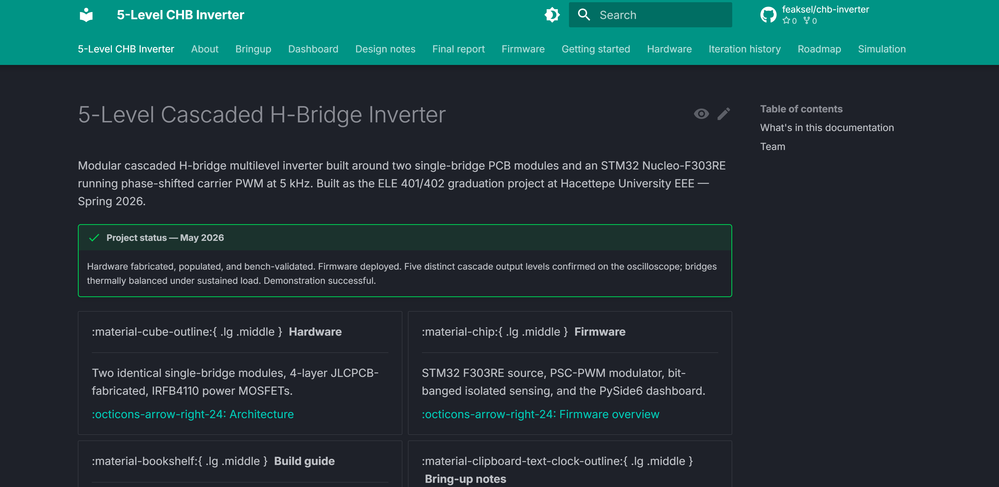
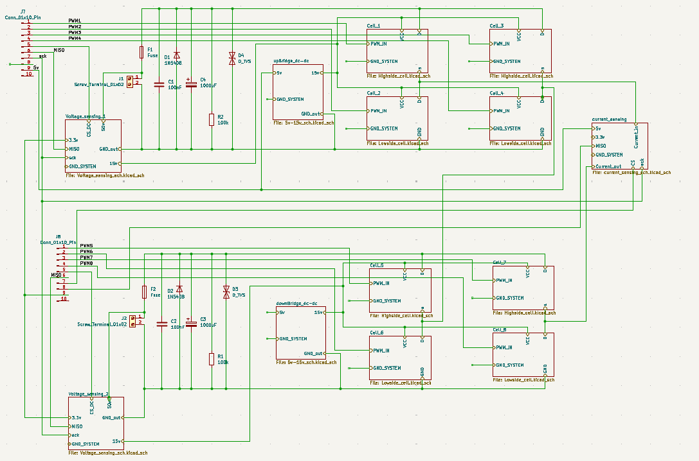
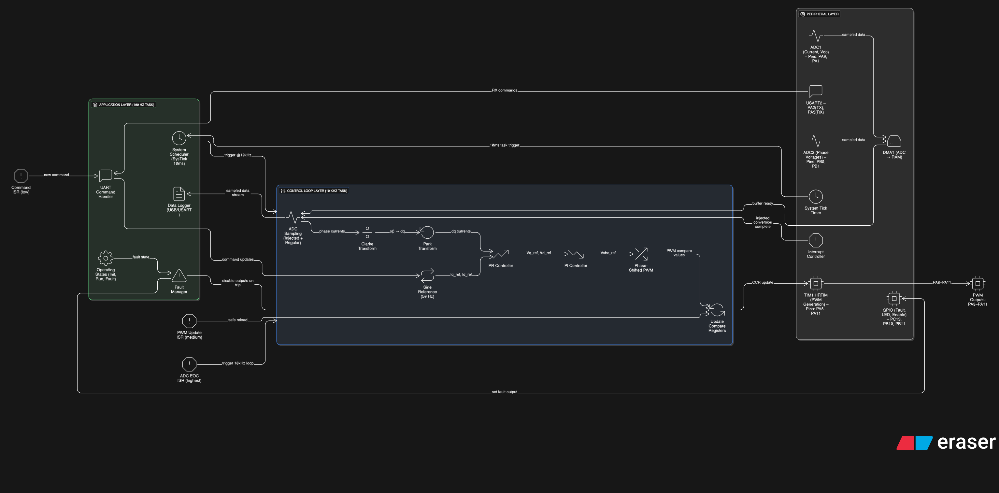
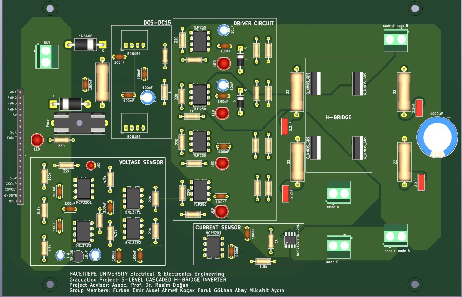
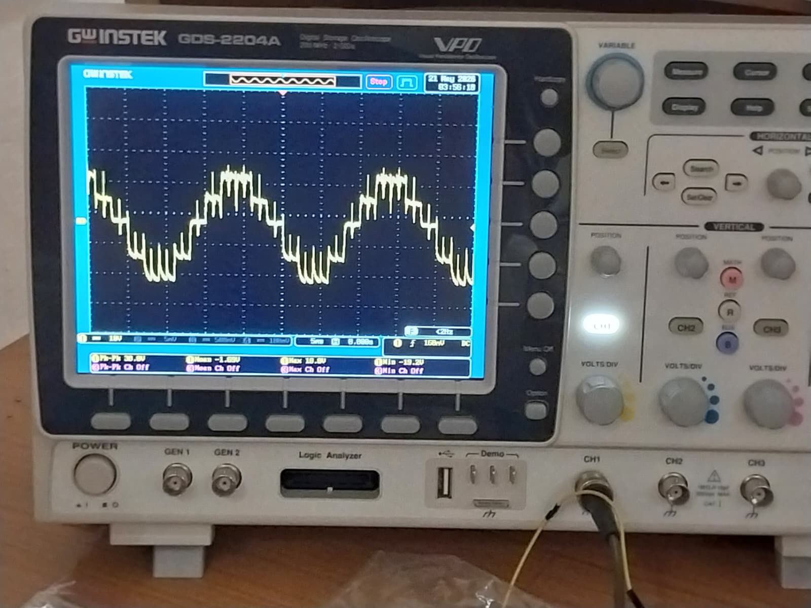
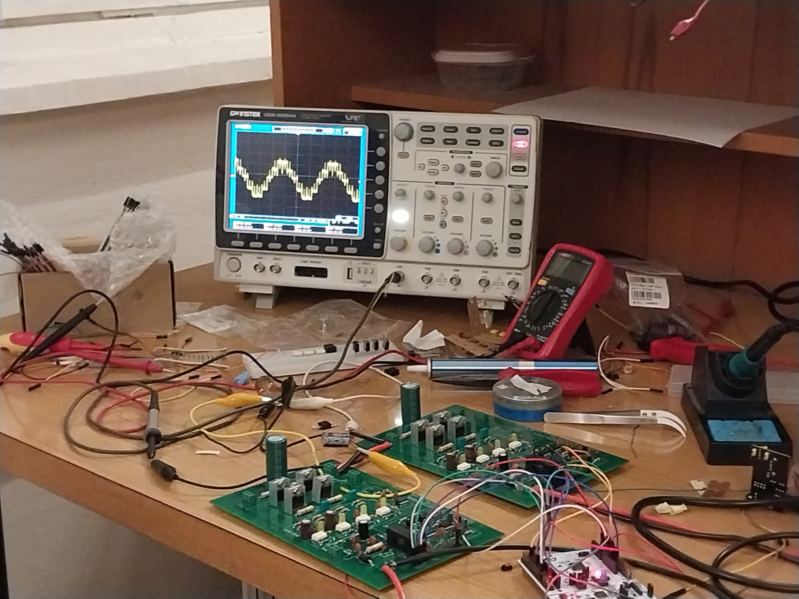
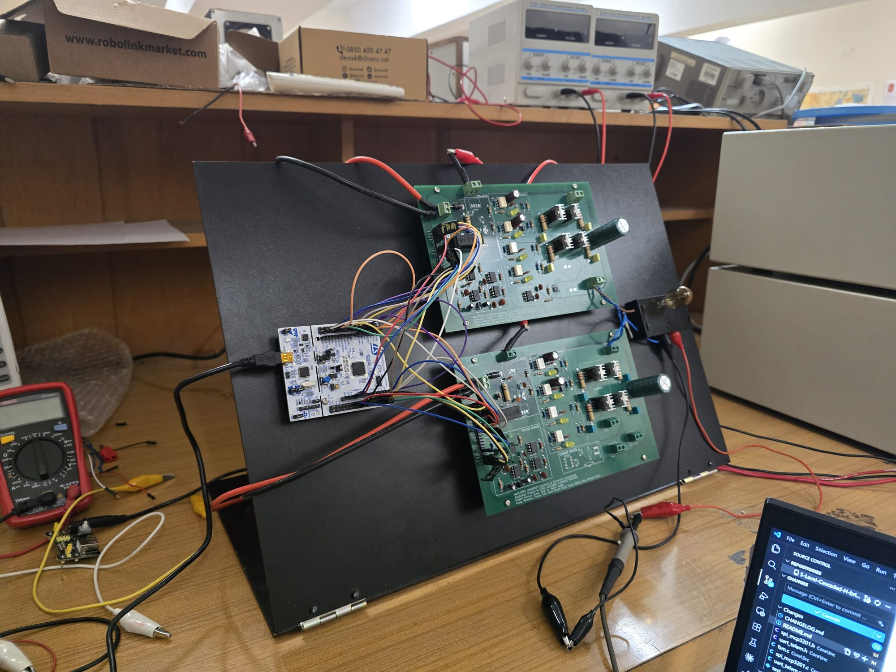
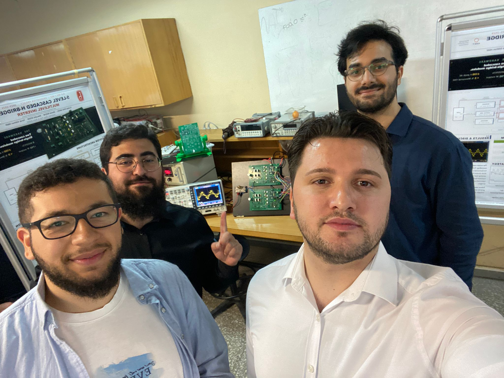

# 5-Level Cascaded H-Bridge Inverter

<p align="center">
  
  <br/>
  <sub><i>The headline result — 100 V output with 5 distinct cascade levels under sustained PSC-PWM at 5 kHz, no filter.</i></sub>
</p>

<p align="center">
  <a href="https://github.com/feaksel/chb-inverter/actions/workflows/docs.yml"></a>
  <a href="https://github.com/feaksel/chb-inverter/actions/workflows/firmware-build.yml"></a>
  <a href="https://github.com/feaksel/chb-inverter/actions/workflows/dashboard-tests.yml"></a>
  <a href="LICENSE"></a>
  <a href="https://feaksel.github.io/chb-inverter/"></a>
</p>

Modular **5-level cascaded H-bridge multilevel inverter** built around two single-bridge PCB modules and an **STM32 Nucleo-F303RE** running **phase-shifted carrier PWM** at 5 kHz. Bench-validated, demonstrated, and now consolidated into a citable engineering record. Built as the **ELE 401/402 graduation project** at **Hacettepe University EEE** — Spring 2026.

> **Status:** Hardware fabricated, populated, and bench-validated. Firmware deployed. Five distinct cascade output levels confirmed on the oscilloscope at 100 V cascade output. Bridges thermally balanced under sustained load. **Demonstration successful.**

## Quick links

<table>
  <tr>
    <td align="center" width="33%"><a href="https://feaksel.github.io/chb-inverter/"></a><br/><b>Documentation site</b></td>
    <td align="center" width="33%"><a href="docs/hardware/build-guide-v4.md"></a><br/><b>Build Guide v4.0</b></td>
    <td align="center" width="33%"><a href="docs/final-report/"></a><br/><b>Final report</b></td>
  </tr>
  <tr>
    <td align="center"><a href="firmware/stm32-f303re/"></a><br/><b>Firmware (STM32 + dashboard)</b></td>
    <td align="center"><a href="hardware/single-bridge-v4/"></a><br/><b>Hardware (KiCad + BOM + gerbers)</b></td>
    <td align="center"><a href="docs/bringup/first-session.md"></a><br/><b>Bring-up session</b></td>
  </tr>
</table>

## What was built

Two identical **single-bridge PCB modules** (4-layer JLCPCB, **IRFB4110** power MOSFETs) cascaded to produce 5 distinct output voltage levels. The STM32 F303RE generates **phase-shifted carrier PWM** at 5 kHz with bit-banged **MCP3201** sensing isolated via **6N137** optocouplers. A **PySide6** desktop dashboard provides full operator control over UART.

<p align="center">
  
  <br/>
  <sub><i>Lab testing setup — the two cascaded single-bridge modules driven by the Nucleo, with the dashboard live on the bench PC.</i></sub>
</p>

The PSC modulation gives natural bridge-balance — both H-bridges carry equal switching load. The deviation from the build-guide's original IPD LS-PWM (which had inherent bridge-loss asymmetry) is documented in the [PSC vs. LSPWM design note](docs/design-notes/psc-vs-lspwm.md). The iteration story from the early IRFZ44N / IPD layouts through the as-built IRFB4110 / PSC design is in [iteration history](docs/iteration-history/).

## On the demo stand

<p align="center">
  
  <br/>
  <sub><i>Demo stand — the inverter wired into the bench supplies + load. Five levels visible on the scope as soon as the supplies were brought up.</i></sub>
</p>

## Team

**Project group "Cereyan Hacıları"** ("The Current Pilgrims"), under **Assoc. Prof. Dr. Rasım Doğan**.

<p align="center">
  
</p>

<table>
  <tr>
    <td align="center"><b>Furkan Emir Aksel</b><br/>Lead, firmware, dashboard</td>
    <td align="center"><b>Ahmet Koçak</b><br/>Hardware, bring-up</td>
    <td align="center"><b>Faruk Gökhan Abay</b><br/>Simulation, analysis</td>
    <td align="center"><b>Mücahit Aydın</b><br/>Hardware, assembly</td>
  </tr>
</table>

<p align="center">
  
  <br/>
  <i>Hacettepe University, Department of Electrical and Electronics Engineering — Ankara, Türkiye, 2026.</i>
</p>

## Repository layout

```
chb-inverter/
├── docs/              # MkDocs Material source — every .md becomes a published page
│   ├── hardware/      # Architecture, build guide v4, BOM, schematic, PCB, photos
│   ├── firmware/      # Pin map, state machine, UART protocol, modulators, protection
│   ├── dashboard/     # Operator workflow, install, architecture
│   ├── simulation/    # Simulink THD analysis
│   ├── bringup/       # First-session + reference (rendered from firmware tree)
│   ├── design-notes/  # 5 design-decision deep-dives (bootstrap, isolation, PSC, IGBT, grounding)
│   ├── iteration-history/  # Per-iteration narrative (4 rounds, 1 → 4 as-built)
│   ├── roadmap/       # 6 future-work tracks
│   ├── final-report/  # Consolidated graduation report
│   └── about/         # Team, supervisor, institution, license
├── hardware/          # KiCad project, gerbers, BOM CSV, populated photos
├── firmware/          # STM32 source (git subtree, full history) + PySide6 dashboard
├── simulation/        # Simulink models (3 variants) + analysis
├── experimental/      # RISC-V SoC + FPGA controller — unverified tracks
├── tools/             # BOM validator, link checker, PCB renderer
└── tests/             # Repo-level CI tests
```

## License

Apache-2.0. See [LICENSE](LICENSE).

## Citation

If this project informs academic work, please cite it. The full citation metadata is in [CITATION.cff](CITATION.cff).

```bibtex
@software{aksel_2026_chb_inverter,
  author       = {Aksel, Furkan Emir and Koçak, Ahmet and Abay, Faruk Gökhan and Aydın, Mücahit},
  title        = {{5-Level Cascaded H-Bridge Inverter with STM32 Nucleo-F303RE}},
  year         = 2026,
  month        = 5,
  publisher    = {Hacettepe University, Department of Electrical and Electronics Engineering},
  version      = {1.0.0},
  url          = {https://github.com/feaksel/chb-inverter}
}
```

## Future / experimental work

The [`experimental/`](experimental/) directory contains exploratory tracks that were **not** validated in silicon and are **not** part of the graduation deliverable:

- [`experimental/risc-v-soc/`](experimental/risc-v-soc/) — A custom **RV32IM SoC** with integrated PWM / ADC / protection / UART / GPIO peripherals, taken through full **Cadence Genus → Innovus → GDSII** flow against the **SkyWater 130 nm PDK**. No tape-out; no FPGA equivalence check. Preserved for continuity.
- [`experimental/fpga-controller/`](experimental/fpga-controller/) — Placeholder for a future FPGA-based controller.

For the roadmap of work that _would_ extend the as-built inverter, see [`docs/roadmap/`](docs/roadmap/).

## Contributing

This repository was produced as a graduation project; it is **not** actively maintained for feature contributions. Issues and pull requests addressing documentation errata, bring-up procedure improvements, or porting to other STM32 variants are welcome. For substantive design changes, please open an issue first to discuss scope.

---

<p align="center">
  <sub>Built in Ankara, Türkiye · Spring 2026</sub>
</p>
