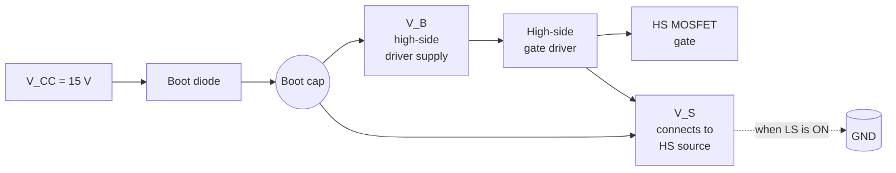

# Bootstrap fundamentals

> **Single-sentence summary.** Bootstrap gate drive — the standard cheap way to drive a high-side N-channel MOSFET — works flawlessly in ground-referenced bridges and fails fundamentally in cascaded floating bridges. This project does **not** use bootstrap for the high-side gate; it uses optical isolation (TLP250) with an isolated 15 V rail per bridge (B0515S).

## The classical bootstrap arrangement

A half-bridge with both MOSFETs being N-channel needs the high-side gate driven 10–15 V **above** the high-side source (VS) — not above ground. The bootstrap arrangement provides that voltage without an isolated supply:

When the **low-side MOSFET is conducting**:
- VS is pulled to ≈ GND through the LS MOSFET.
- The bootstrap diode is forward-biased and the bootstrap cap charges from VCC to ≈ VCC − Vdiode.

When the **high-side MOSFET is turned on**:
- VS rises toward VDC (the bridge bus).
- The bootstrap cap rides up with VS — the cap maintains VB ≈ VS + (VCC − Vdiode).
- The high-side driver now has its 10–15 V supply referenced to the (now-floating) VS.

The bootstrap diode prevents the cap from discharging back into VCC when VS rises. Total parts count: one diode, one cap. Cheap, well-understood, and the reason the IR2110 has been the workhorse gate driver for ground-referenced bridges for 30+ years.

## Where it breaks

The arrangement above has one hard requirement that's easy to miss: **VS must return to ≈ GND every PWM period** to recharge the bootstrap cap. Three independent things can violate that requirement:

| Violation | Mechanism | Failure |
|---|---|---|
| **Duty cycle too high** | The HS leg conducts > 95 % of the period; the LS-on window is too short for the bootstrap cap to recharge. | Bootstrap cap voltage sags over consecutive cycles; HS gate drive eventually drops below threshold; HS leg can't turn on; output collapses. |
| **Bridge floats** | In a CHB, the **upper** bridge's VS never returns to true ground — it stays at the cascade voltage minus its own bridge voltage. | Bootstrap diode reverse-biased the whole time; cap never charges; HS gate never sees ≥ Vth. |
| **Bootstrap diode too slow** | Cap charging current spikes hard at the LS turn-on edge; a slow recovery diode (e.g. 1N4007) can't refresh fast enough. | Cap charges to less than VCC; HS gate voltage marginal. |

The first failure mode (duty > 95 %) is handled in firmware. The third is handled by part choice (UF4007 fast recovery, 75 ns trr). The second is fundamental to CHB topology and is the reason **this project does not use bootstrap for the high-side gates**.

## How the firmware respects the duty constraint

[`Core/Src/pwm_modulator.c`](https://github.com/feaksel/chb-inverter/blob/main/firmware/stm32-f303re/Core/Src/pwm_modulator.c) clamps the high-side duty:

| Modulator | LOW clamp | HIGH clamp |
|---:|---:|---:|
| `STAIR`     | 0.01 | 0.95 |
| `STAIR_ALT` | 0.01 | 0.95 |
| `PSC`       | 0.05 | 0.95 |

The 95 % HIGH clamp guarantees a minimum 5 % LS-on window per cycle — enough for the **10 µF UF4007-fed bootstrap cap** to refresh.

The firmware also runs a **6 ms bootstrap precharge** sequence in the PRECHARGE state before transitioning to RUN: all low-sides are driven ON for 3 PWM periods at 500 Hz, so the bootstrap caps are fully primed before any HS switching happens. See [Build Guide v4.0 §6 Gate drive](../hardware/build-guide-v4.md).

## Why this project uses isolated supply, not bootstrap

The bootstrap arrangement, even with the firmware clamps and the precharge sequence, would still fail for the upper bridge: its VS never returns to ground because the bridge is floating at the cascade voltage. The team simulated the IR2110 + bootstrap path in Simulink and confirmed the failure mode — see [`docs/design-notes/chb-isolation.md`](chb-isolation.md) and the ELE 401 interim report §4.4.

The as-built design uses **TLP250 optical isolation per gate** with an **isolated 15 V rail per bridge** (B0515S 5V→15V isolated DC-DC). No bootstrap cap, no bootstrap diode, no duty constraint, no floating-bridge constraint. The TLP250 has 2.5 kV galvanic isolation and the same effective drive regardless of where VS sits.

This adds parts and cost (eight TLP250 + two B0515S vs. two IR2110), but eliminates the bootstrap failure mode entirely. For a CHB, the trade is not optional — it is the only correct choice.

## What to remember

- Bootstrap is for ground-referenced bridges only.
- The duty constraint (LS-on > some minimum each cycle) is real and is enforced by the firmware's 95 % clamp.
- The bootstrap precharge sequence is what makes the 6 ms PRECHARGE state non-negotiable before any RUN command.
- If anyone proposes adding bootstrap drive to a cascade stage above the ground-referenced one — point them at this page.

Related: [CHB isolation](chb-isolation.md), [IGBT vs. MOSFET](igbt-vs-mosfet.md), [PSC vs. LSPWM](psc-vs-lspwm.md), and [firmware → modulators](../firmware/modulators.md) for the clamp values in code.
