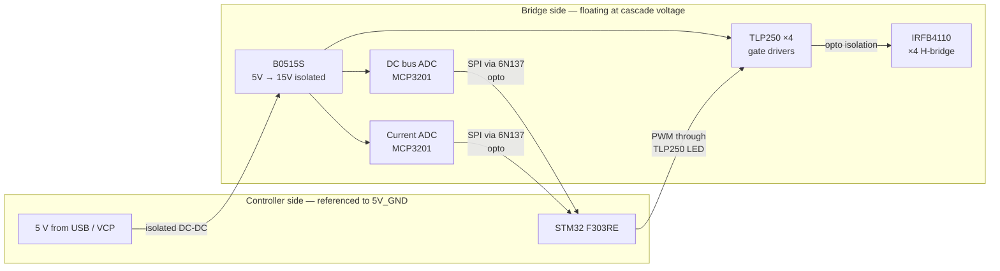

# CHB isolation

> **Single-sentence summary.** Cascaded H-Bridge topology imposes an **absolute** requirement for galvanic isolation between each bridge and the controller, because every bridge above the ground-referenced cell sits at a floating potential that swings with the cascade-output. Anything that touches both sides without isolation will eventually let the floating side damage the controller side.

## What "floating" means in CHB

In a 5-level CHB with two cells:

- **Bridge 1** (lower cell): its low-side rail is the system ground reference. VS of its HS MOSFETs only swings between 0 and +VDC1.
- **Bridge 2** (upper cell): its low-side rail is **not** ground — it's the output node of Bridge 1, which itself swings between -VDC1 and +VDC1. So Bridge 2's "ground" floats between -VDC1 and +VDC1, and Bridge 2's HS source rides on top of that with another ±VDC2 of swing.

At VDC1 = VDC2 = 50 V, the floating ground of Bridge 2 can be anywhere from -50 V to +50 V relative to controller ground. The HS source of Bridge 2 can be at +100 V relative to controller ground at the positive cascade peak.

This is not a tolerance issue. It's not noise. It's the **defined behavior** of the topology. Any approach to driving or sensing Bridge 2 that doesn't account for it will fail.

## What breaks without isolation

The first instinct — share a common 15 V VCC, run the gate signal directly from the STM32 to the IR2110 inputs, share the SPI bus for the MCP3201 ADC — fails in three distinct ways. The team simulated each and confirmed.

### 1. Bootstrap drivers can't supply gate voltage

The IR2110 (and any bootstrap-based driver) has its **COM** pin connected to VS of the HS MOSFET. On Bridge 2, that COM pin floats at the cascade voltage minus the bridge voltage. The driver chip's internal logic now references a voltage that can swing 100 V at the PWM rate. The result:

- The bootstrap cap path through the IR2110 internal structure can't tolerate the common-mode swing.
- Even if it could, the bootstrap diode reverse-biases on every cycle when VS rises — the cap never refreshes.
- The driver's input logic, referenced to COM, sees the controller-side PWM signal at -50 V to +50 V common mode. Latch-up or destruction is the typical outcome.

Simulink validation (per the ELE 401 interim report §4.4) showed gate drive voltage dropping to < 5 V on Bridge 2 with IR2110 — MOSFETs never fully turn on. **This was the deciding evidence** that the IR2110 path could not be made to work and the project had to commit to optical isolation.

### 2. Common-mode coupling destroys the controller

Even if the gate driver problem were somehow solved (it can't be, but suppose), the SHARED 15 V supply between Bridge 2 and the controller is a common-mode path. When Bridge 2 swings its floating ground by 50 V at 5 kHz, that same V is impressed on the controller's VCC — at high di/dt through the parasitic capacitance of the shared supply.

The STM32 sees this as massive ground noise. ADC readings are garbage. UART corrupts. Eventually a transient exceeds the GPIO clamp and a pin is destroyed.

### 3. Sensing can't read the floating side

The MCP3201 on the floating bridge needs to measure voltages relative to that bridge's ground (so it can read the local DC bus). If you connect its SPI back to the controller without isolation, you're connecting controller ground to bridge ground — instantly defeating the isolation that the gate drivers also need.

## How the as-built handles it

The single-bridge v4 design implements isolation at **every** interface that crosses from the floating bridge to the controller:

Four isolation barriers:

| Barrier | Component | Spec |
|---|---|---|
| Gate drive | TLP250 optical | 2.5 kV galvanic, LED → photodetector + MOSFET output |
| Gate supply | B0515S DC-DC | 1 W, 4.5–5.5 V → 15 V, ≥ 3 kV isolation per part |
| ADC clock + chip-select | 6N137 optocoupler | 10 Mbit/s, separate one per signal |
| ADC data return | 6N137 optocoupler | Same — independent line for the MISO |

The two grounds (**5V_GND** on the controller side, **50V_GND** on the bridge side) are connected **only** through these isolation parts. Nothing else — no shared trace, no shared via, no shared cable shield — bridges the two grounds.

When that rule is violated, the symptoms are the [grounding-fix](grounding-fix.md) story — iteration 3 hit exactly that failure.

## Per-bridge isolation, not per-cell isolation

A subtle point: even **Bridge 1** (the ground-referenced one) is fully isolated from the controller in the as-built design. This is over-engineering relative to the strict topology requirement, but it's the right choice:

- The two PCB modules are **identical** — same layout, same parts, same isolation. Operating only one of them isolated and the other not would mean two different boards in stock, two different fab orders, and two different bring-up procedures.
- During bench bring-up, only one bridge is energized at a time. With both isolated, either can be the bench-test bridge without rewiring.
- For a future product, modularity matters more than the BOM saving from skipping the isolation parts on Bridge 1.

The cost: ~50 TL of extra DC-DC + optocouplers per module on the lower-bridge instance. Worth it.

## What to remember

- Isolation is a **topology requirement**, not a design preference.
- The IR2110 cannot drive a floating bridge. This was simulation-validated before any silicon was committed.
- Optical isolation (TLP250 for gates, 6N137 for SPI) + isolated DC-DC (B0515S) is the standard solution.
- Both modules use identical isolation so the modules are interchangeable.

Related: [Bootstrap fundamentals](bootstrap-fundamentals.md), [Grounding fix](grounding-fix.md), [Build Guide v4 §3 Isolation architecture](../hardware/build-guide-v4.md).
