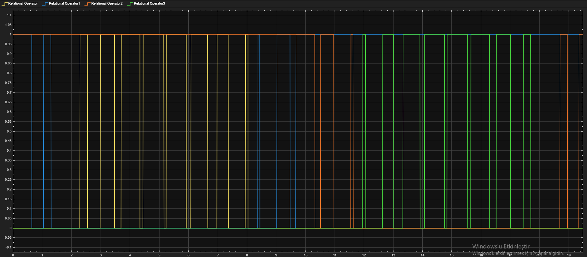

# Design notes

<figure markdown="span">
  { loading=lazy width=75% }
  <figcaption>The two cells' carriers overlap to produce the cascade output. This visual ties together the modulation, isolation, and gate-drive arguments that each design note covers in detail.</figcaption>
</figure>

Standalone explanations of the engineering decisions that shaped the as-built design. Each note answers a single "why did we do it this way?" question. Drawn from the firmware CHANGELOG, the ELE 401 / 402 interim reports, the prior-chat design discussion, and the team's own bench experience.

| Note | Question it answers |
|---|---|
| [Bootstrap fundamentals](bootstrap-fundamentals.md) | How the high-side gate driver gets a reference, why bootstrap fails in CHB, and why the project uses isolated 15 V instead. |
| [CHB isolation](chb-isolation.md) | Why each bridge needs galvanic isolation from the controller, what specifically breaks without it, and how the as-built handles every isolation barrier. |
| [PSC vs. LSPWM](psc-vs-lspwm.md) | The cascade-balance argument that drove the switch from IPD level-shifted PWM to phase-shifted carriers. |
| [IGBT vs. MOSFET](igbt-vs-mosfet.md) | The quantitative loss analysis at 50 V / 5 kHz, why the IRFB4110 replaces the IRFZ44N from v3.1, and what changes in the firmware as a result. |
| [Grounding fix](grounding-fix.md) | The 5V_GND ↔ 50V_GND coupling issue that bit iteration 3 and how the 4-layer iteration-4 layout resolves it. |
| [Glossary](glossary.md) | Short definitions for terms used across this site. Read when an acronym or part number doesn't ring a bell. |

Each note is self-contained — read whichever the current decision touches. Cross-references point to the firmware source, the build guide, and the iteration history where relevant.
