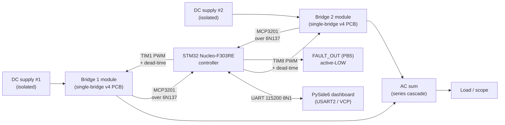
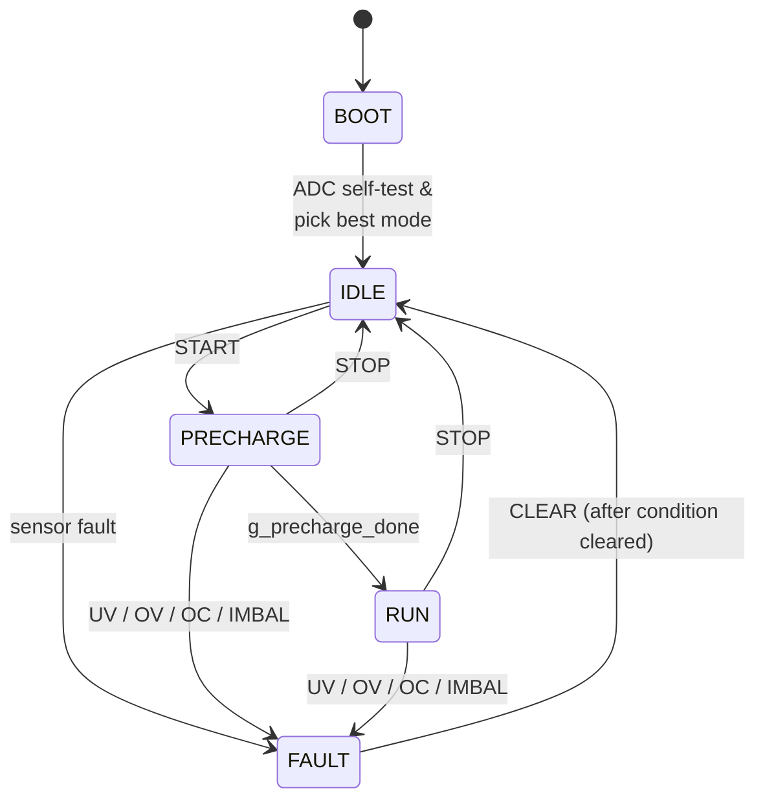

# Final graduation report — 5-Level Cascaded H-Bridge Inverter

<p align="center">
  
  <br/>
  <sub><i>The project poster — a one-page summary of the work. Downloadable as <a href="../assets/pdfs/CHB_Inverter_Poster_v5.pdf">PDF</a> or <a href="../assets/pdfs/CHB_Inverter_Poster.pptx">editable PowerPoint</a>.</i></sub>
</p>

!!! tip "Download the formatted PDF"
    The final report is also available as a **formatted PDF** that follows the ELE 402 template structure (title page, abstract, TOC, list of figures, all 12 numbered sections, references):
    
    👉 **[Download `ELE402_Spring2026_FR_CereyanHacilari.pdf`](../assets/pdfs/ELE402_Spring2026_FR_CereyanHacilari.pdf)** (37 pages, 14 MB)
    
    The PDF is generated from [`tools/generate-final-report.py`](https://github.com/feaksel/chb-inverter/blob/main/tools/generate-final-report.py) and is regenerable from the canonical source material in the repo. The Markdown rendering on this page is the same content in browseable form.

This report **supersedes** the ELE 401 interim report (Fall 2025) and the ELE 402 interim report v4 (Spring 2026). Both source documents are preserved verbatim at [`docs/assets/pdfs/`](https://github.com/feaksel/chb-inverter/tree/main/docs/assets/pdfs).

**Authors:** Cereyan Hacıları — Furkan Emir Aksel, Ahmet Koçak, Faruk Gökhan Abay, Mücahit Aydın.
**Supervisor:** Assoc. Prof. Dr. Rasım Doğan.
**Institution:** Hacettepe University, Department of Electrical and Electronics Engineering — Ankara, Türkiye.
**Date:** May 2026.

---

## 1. Abstract & project summary

This report documents the design, fabrication, firmware development, bench validation, and demonstration of a **single-phase 5-level cascaded H-bridge (CHB) multilevel inverter**, built as the ELE 401/402 graduation project at Hacettepe University EEE during the 2025–26 academic year. The system uses **two identical single-bridge PCB modules** (4-layer JLCPCB-fabricated, **IRFB4110** N-channel MOSFETs) cascaded externally so their AC outputs sum to five distinct voltage levels at the inverter terminals. The controller is an **STM32 Nucleo-F303RE** running **phase-shifted carrier PWM (PSC-PWM)** at 5 kHz with hardware-enforced 3 µs dead time. Isolated bit-banged **MCP3201** SPI ADCs sense per-bridge DC bus voltages and output current via **6N137** optocouplers; an **isolated 5 V → 15 V B0515S DC-DC** supplies the **TLP250** optical gate drivers per bridge so that no bridge ever shares a ground reference with the controller. A **PySide6** desktop dashboard provides full operator control, 20 Hz telemetry visualization, replay, and a PC-only fault-scenario simulator.

The headline bench result: **five distinct cascade output levels visible on the oscilloscope at 100 V cascade output**, under sustained 5 kHz PSC-PWM operation with no output filter; both bridges thermally matched within ≈ 3 °C; no false sensor-loss or protection-trip events across multi-minute runs. The project converged to this configuration over four hardware iterations — earlier rounds (single dual-bridge PCB, IRFZ44N MOSFETs, IPD level-shifted PWM) surfaced V<sub>DSS</sub>-headroom problems, bootstrap-timing failures, isolation-defeating grounding errors, and bridge-loss asymmetry that all compounded into the iteration-4 re-architecture. The narrative of those four iterations and the design decisions behind each correction is the bulk of this report.

---

## 2. System architecture

### 2.1 Topology

Cascaded H-Bridge (CHB) multilevel topology connects N full-bridge cells in series, each generating three voltage levels (+V<sub>DC</sub>, 0, −V<sub>DC</sub>); the series connection produces (2N + 1) distinct output voltage levels. For **N = 2 cells** this project, the output levels are **{−2V<sub>DC</sub>, −V<sub>DC</sub>, 0, +V<sub>DC</sub>, +2V<sub>DC</sub>}** — five distinct levels. At the nominal 50 V bus per cell, the cascade output swings ±100 V.

Compared to the two other multilevel inverter topologies considered — Neutral Point Clamped (NPC) and Flying Capacitor (FC) — CHB is the most modular: each cell is mechanically and electrically interchangeable, with its own isolated DC source. NPC requires clamping diodes and has complex voltage-balancing dynamics; FC requires large pre-charged capacitors and has aging issues. CHB's "isolated DC source per cell" requirement — usually flagged as a constraint — is actually an advantage for renewable-energy integration, where independent PV strings or battery packs naturally supply isolated DC. Detailed topology selection rationale is preserved verbatim in [ELE 401 interim §6.1](https://github.com/feaksel/chb-inverter/blob/main/docs/assets/pdfs/ELE401_Fall2025_IR.pdf).

### 2.2 System block diagram



The full architectural detail is in [docs/hardware/architecture](../hardware/architecture.md); the diagram above is the report-scale view.

### 2.3 The isolation architecture

CHB topology imposes an **absolute requirement** for galvanic isolation between every bridge above the ground-referenced cell and the controller. The reason: in a cascaded topology, the upper bridge's source nodes float at the cascade-output voltage minus their own bridge voltage — at peak this is +100 V relative to controller ground at 5 kHz. Bootstrap-based gate drivers (IR2110 and similar) cannot supply gate voltage referenced to a floating V<sub>S</sub> that never returns to true ground each PWM period; their bootstrap capacitor reverse-biases continuously and the gate drive collapses. This was simulation-validated in Simulink with an IR2110 behavioural model before any silicon was committed (see [§5.1](#51-iteration-1) and [chb-isolation design note](../design-notes/chb-isolation.md)).

The as-built system implements isolation at four interfaces, each per bridge:

| Barrier | Component | Spec |
|---|---|---|
| Gate drive | TLP250 optical | 2.5 kV galvanic, LED → photodetector + MOSFET output |
| Gate supply | B0515S DC-DC | 1 W, 5 V → 15 V, ≥ 3 kV isolation per part |
| ADC clock + chip-select | 6N137 optocoupler | 10 Mbit/s — one per signal |
| ADC data return | 6N137 optocoupler | Same — independent line for MISO |

A subtle point: **both** modules in the as-built design implement full isolation, even though Bridge 1 (the lower cell) is strictly ground-referenced and could in principle skip it. The reason is modularity — two identical boards means one fab order, one stock SKU, and either module can serve as the bench-test instance during bring-up. The ≈ 50 TL per module of isolation parts is the cost of that interchangeability. We considered it worth it.

### 2.4 Operator interaction

The controller exposes a single USART2 link (115200 8N1) over the Nucleo's ST-LINK virtual COM port. A line-based command protocol gives the operator runtime control over every relevant parameter — modulator selection (`MOD STAIR|PSC|STAIR_ALT`), switching frequency (`FSW 100..20000` Hz), fundamental frequency (`FFUND 10..400` Hz), modulation index (`MI 0.0..0.95`), per-bridge isolation (`BRIDGE BOTH|B1|B2`), nominal bus voltage for protection scaling (`VNOM 5..60`), and overcurrent trip (`OC 0.5..20` A). A 20 Hz telemetry frame returns state, sensing mode, fault bits, all sensor values, and the current modulator level. Each PWM-config change emits a fresh `$C,...,lock=OK|BAD` line so the operator can confirm the carrier phase is locked before arming the bridge.

The full UART command set + telemetry frame format is documented at [docs/firmware/uart-protocol](../firmware/uart-protocol.md). The PySide6 dashboard handles all of these commands through a GUI, with an explicit `Arm live START` checkbox gating any command that would energize the bridges.

---

## 3. Hardware design

### 3.1 Power stage — IRFB4110

| Parameter | IRFB4110 (as-built) | IRFZ44N (v3.1, superseded) |
|---|---|---|
| V<sub>DSS</sub> | 100 V | 55 V |
| Continuous I<sub>D</sub> | 180 A @ 25 °C | 49 A @ 25 °C |
| R<sub>DS(on)</sub> @ V<sub>GS</sub> = 10 V | 4.5 mΩ | 17.5 mΩ |
| Total gate charge Q<sub>G</sub> | ≈ 150 nC | ≈ 67 nC |
| Package | TO-220AB | TO-220AB |

The MOSFET-vs-IGBT analysis at the project's operating point (50 V bus, 5 kHz switching, ≈ 400 W) is unambiguous in favour of MOSFETs — every loss term wins. The detail and the arithmetic are in the [IGBT vs. MOSFET design note](../design-notes/igbt-vs-mosfet.md); summary:

- **MOSFET conduction loss** at 5 A RMS: 5² × 0.0045 ≈ **0.11 W per device**. IGBT (V<sub>CE(sat)</sub> ≈ 1.4 V): **7.0 W per device** — a 63× difference.
- **MOSFET switching loss** at 5 kHz, 25 V, 7 A: ≈ **0.19 W per device**. IGBT with tail current: ≈ **5 W per device**.
- **System-wide power-stage loss**: MOSFET ≈ 2.4 W (≈ 99.4 % efficiency), IGBT ≈ 96 W (≈ 80 % efficiency).

The IRFZ44N → IRFB4110 swap happened mid-project (between iterations 3 and 4) for three independent reasons. **V<sub>DSS</sub> headroom**: a 55 V part on a 50 V bus has only ≈ 10 % nominal headroom, which gate-loop ringing easily exceeds. **TVS / V<sub>DSS</sub> mismatch**: the 1.5KE62A TVS clamps at 84.5 V — *above* the IRFZ44N V<sub>DSS</sub>, meaning a TVS-firing event would damage the MOSFETs anyway. **Conduction loss**: 4.5 mΩ vs. 17.5 mΩ is 4× lower, giving meaningful thermal headroom for an unenclosed bench prototype. The trade is the firmware's dead time, which had to rise from 2 µs (IRFZ44N) to **3 µs** (IRFB4110, BDTR.DTG = 0xA0) to accommodate the ~2× larger gate charge.

### 3.2 Gate drive — TLP250 + B0515S

Eight TLP250 optocouplers (one per MOSFET) provide 2.5 kV galvanic isolation between the controller's PWM outputs and the MOSFET gates. Each TLP250 has its output stage powered from a per-bridge isolated 15 V rail produced by a B0515S 5 V → 15 V isolated DC-DC converter. The 22 Ω gate series resistor and the 10 kΩ gate-source pull-down per MOSFET keep gate ringing controlled and ensure the MOSFET is held off whenever the driver is unpowered.

Bootstrap drive (IR2110) is **not used** anywhere in this design. The reasoning is detailed in the [bootstrap-fundamentals](../design-notes/bootstrap-fundamentals.md) and [CHB-isolation](../design-notes/chb-isolation.md) design notes; the short version is that bootstrap requires the high-side source to return to ground each PWM period to refresh the bootstrap cap, which the upper bridge in a cascaded topology never does. Iteration 2 confirmed this experimentally in addition to the Simulink prediction.

The TLP250 is non-inverting (LED ON → output HIGH → MOSFET ON). Combined with `BDTR.OSSI = 1` on the STM32 advanced timers, this means every state where the firmware *thinks* a bridge is off actually drives all four MOSFETs of that bridge off — including at boot, on fault, and on PWM disable. This safety property is preserved across every firmware state.

### 3.3 Sensing — MCP3201 + ACS712 + 6N137

DC bus voltage and output current are read by **MCP3201** 12-bit successive-approximation ADCs on the floating-bridge side. SPI signals (SCK, CS, MISO) cross the isolation barrier through dedicated **6N137** optocouplers per line. ACS712 Hall-effect current sensors (100 mV/A, 2.5 V zero offset) provide the per-bridge AC current sense.

A few specifics that became important during bring-up:

- **The 6N137 inverts** (LED on → output low). The firmware drives and reads each SPI line through an adjustable inversion mask — the `SPIINV <0..7>` runtime command (bit 0 = SCK, bit 1 = CS, bit 2 = MISO). Without this, an odd number of inverting stages causes the MCP3201 to see a backward clock or chip-select and return garbage. `SPIINV 7` (all three lines inverted) is the standard one-6N137-per-line wiring.
- **The two bridges share isolated MISOs asymmetrically.** The lower-bridge island has one MCP3201 (DC1) on its own MISO line. The upper-bridge island has two MCP3201s (DC2 and current) that wire-share a single isolated MISO return. The firmware reads strictly one channel at a time, per chip-select, to avoid bus contention — this was a mid-project rewrite of the original "3-independent-MISO" assumption (see [iteration-3](../iteration-history/iteration-3.md)).
- **The MCP3201 frame layout** is `[NULL][B11..B0][X][X][X]` — the firmware extracts the 12 data bits with `(raw >> 3) & 0x0FFF`. This is documented in Build Guide v3.1 §7.3, with a bringup-verification comment in the firmware that explains how to swap to `>> 1` if a known DC input reads ~8× off.

### 3.4 Protection chain

| Element | Purpose | Trip threshold |
|---|---|---|
| **1.5KE62A TVS** (per DC bus) | Clamp switching spikes below MOSFET V<sub>DSS</sub> | 84.5 V clamp (sits below IRFB4110's 100 V V<sub>DSS</sub>) |
| **15 A blade fuse** (per DC input) | Short-circuit protection | 15 A continuous |
| **RC snubber** (per MOSFET) | Damp V<sub>DS</sub> ringing | 22 Ω 2 W + 2.2 nF / 630 V across D-S |
| **Firmware UV** | DC bus undervoltage | 0.80 × VNOM (default 40 V at VNOM = 50) |
| **Firmware OV** | DC bus overvoltage | 1.16 × VNOM (default 58 V) |
| **Firmware OC** | Output overcurrent | Operator-set, default 15 A, range 0.5–20 A |
| **Firmware IMBAL** | DC bus imbalance | 0.20 × VNOM (default 10 V difference) |
| **Sensor-lost** | Required ADC stuck at rail | Auto-latched after 5 consecutive stuck reads |
| **N-of-M debounce** | Reject single-sample noise on every trip condition | 3 consecutive 1 kHz scans (3 ms) |
| **Hardware FAULT_OUT (PB5)** | External fault indicator / interlock | Active-LOW when any fault latched |
| **`BDTR.MOE = 0` on trip** | Master output disable | Drives all MOSFETs OFF via OSSI=1 |

The protection chain has both hardware and software layers, with **soft-thresholds that scale with VNOM** so the inverter can be bench-tested below the 50 V design point (e.g. at 12 V) without UV firing immediately. Details on the threshold derivation and the auto-mode-demotion behaviour are in [docs/firmware/protection](../firmware/protection.md).

### 3.5 PCB stack-up and layout

**4-layer FR-4 TG155**, 1.6 mm thick, 1 oz outer / 0.5 oz inner copper, HASL-with-lead surface finish, fabricated by JLCPCB. The 4-layer choice was driven by the iteration-3 grounding failure — see [iteration-3](../iteration-history/iteration-3.md) and [grounding-fix design note](../design-notes/grounding-fix.md). The inner layers carry **two separate ground pours**: 5V_GND on L2 (controller region only, isolated from the bridge regions) and 50V_GND on L3 (per-bridge pours, never connected to each other or to 5V_GND). The only paths between these grounds are the four isolation parts (TLP250, B0515S, 6N137 × 2). Stitched ground vias bind L1↔L2 in the controller region and L1↔L3 in each bridge region; no via crosses the isolation boundary.

The full stack-up specification + JLCPCB order checklist is at [`hardware/single-bridge-v4/stackup.md`](https://github.com/feaksel/chb-inverter/blob/main/hardware/single-bridge-v4/stackup.md).

---

## 4. Firmware design

### 4.1 Architecture

The firmware is **bare-metal CMSIS** with a thin HAL bring-up shim (retained from CubeMX so HAL_IncTick fires from SysTick). Runs on the STM32F303RE at **64 MHz** from HSI/2 × PLL — no external crystal required. Total Flash usage: 36 KB of 512 KB available. RAM: 4.1 KB of 64 KB. Zero warnings under `-Wall -Wextra -Wshadow -Wundef`. Source at [`firmware/stm32-f303re/`](https://github.com/feaksel/chb-inverter/tree/main/firmware/stm32-f303re/) in this repo (imported via `git subtree` with full upstream history).

The control flow:

1. **main()** initializes the system clock → SysTick @ 1 kHz → sine LUT (256 samples) → GPIO → TIM1 + TIM8 (with `BDTR.MOE = 0` at boot) → TIM6 → USART2 → NVIC → FSM.
2. **TIM1 update IRQ** (5 kHz with PSC, 500 Hz with STAIR) dispatches to the active modulator. The modulator owns all PWM duty-cycle writes (CCR1/CCR2 on TIM1 and TIM8).
3. **TIM6 IRQ** (1 kHz) sets `g_sense_pending`. The main loop calls `Sensing_Service()` for the blocking bit-banged SPI reads — keeps the bit-banger out of interrupt context where higher-priority IRQs would stretch the SCK timing.
4. **Main loop** runs `FSM_Run()` — handles UART commands, services sensing, runs protection, manages state transitions, emits the 20 Hz telemetry frame.

The decision to go bare-metal rather than HAL is documented in the firmware CHANGELOG: HAL adds layers of indirection that are awkward to reason about for a hard real-time control loop. The HAL is compiled but only `HAL_IncTick()` actually runs.

### 4.2 Finite state machine



Five states, with the following per-state semantics:

| State | MOE | Behavior |
|---|---|---|
| **BOOT** | 0 | Hardware init, ADC self-test, sensing-mode auto-selection. Drops to IDLE. |
| **IDLE** | 0 | Both advanced-timer MOE bits low. Accepts all commands. |
| **PRECHARGE** | 1 | MOE on; PWM ISR forces all low-side MOSFETs ON for 6 ms (3 PWM periods at 500 Hz) to seed the bootstrap-style charge equilibrium. Drops to RUN when `g_precharge_done`. |
| **RUN** | 1 | PWM enabled. Protection runs after every 1 kHz sensor scan. |
| **FAULT** | 0 | MOE forced off via `BDTR.MOE = 0`; fault bits latched; `FAULT_OUT` pin pulled LOW. Operator must send `CLEAR` *after* the underlying condition is gone. |

The 3 ms (3-sample) N-of-M debounce on every fault trip rejects single-sample noise without significantly delaying the protection response. A manual operator-initiated trip (`TRIP` command, latches `FAULT_MANUAL = 0x20`) exercises the full fault path for demos even when no sensor is reading a real out-of-range value.

The **auto-start** path is layered on top: if no UART RX byte is received within 3 s of `FSM_Init()`, the FSM issues its own `START` with the loaded defaults and emits `$A,AUTO_START`. This makes the firmware usable in unattended-demo deployments (USB just powering the Nucleo, no PC). The dashboard's `SerialSource` transmits `STATUS` on connect and on every detected `BOOT_SELF_TEST_DONE`, which cancels auto-start whenever an operator is present — including across Nucleo resets.

### 4.3 Modulators — STAIR, PSC, STAIR_ALT

The firmware ships three modulators, selectable at runtime over UART:

| Modulator | Switching strategy | When to use |
|---|---|---|
| **STAIR** *(default boot)* | 500 Hz quantize-to-5-levels staircase; Bridge 1 carries the ±1 step | Known-good fallback; not real PWM, but immediately produces 5 distinct levels on scope |
| **PSC** *(as-built default after bench)* | Unipolar phase-shifted carrier SPWM; TIM8 CNT preset to PWM_PERIOD/2 for the 90° carrier shift | The project deliverable; bridges thermally balanced |
| **STAIR_ALT** | Same staircase output as STAIR, but the bridge carrying the ±1 step alternates | Hard-fallback if PSC's carrier shift cannot be made to work on a particular hardware revision |

The selection rationale — particularly the IPD-LS-PWM → PSC switch motivated by Bridge 1's thermal asymmetry — is in [psc-vs-lspwm](../design-notes/psc-vs-lspwm.md). The implementation gotcha for PSC is that the TIM8 ↔ TIM1 counter offset must hold at exactly ARR/2 (90° phase) or the cascade output degrades from 5-level back to 3-level. The firmware hardens this with three measures:

1. **TIM8 CNT is written after `CR1_CEN` is set**, so the post-`EGR_UG` update generation cannot clobber it.
2. **The actual measured offset is read back** and exposed as `g_pwm_measured_cnt_offset`.
3. **A boolean `lock`** is published: `OK` if the measured offset is within ±5 ticks of ARR/2, `BAD` otherwise. The `$C,...,cntoff=N,lock=OK|BAD` telemetry line reports both, so the operator can confirm the carrier phase is locked before arming the bridges.

A `BAD` lock at any time during operation lets the operator fall back to `STAIR_ALT` as a hard backup without losing 5-level output — STAIR_ALT always gives 5 distinct levels because it's static-level selection, not PWM modulation.

### 4.4 Sensing modes

The firmware supports six per-mode protection configurations, auto-selected at boot based on which MCP3201 channels are responsive:

| ID | Mode | Sensors | Active protection |
|---:|---|---|---|
| 0 | `FULL` | DC1, DC2, current | UV, OV, OC, IMBAL |
| 1 | `DC_ONLY` | DC1, DC2 | UV, OV, IMBAL |
| 2 | `CUR_ONLY` | Current | OC |
| 3 | `OPEN` | None | **None** — emits a UART warning when selected or started |
| 4 | `DC1` | DC1 (+ optional current) | DC1 UV/OV + OC if available |
| 5 | `DC2` | DC2 (+ optional current) | DC2 UV/OV + OC if available |

At boot, each ADC is read four times. Channels stuck at `0x000` or `0xFFF` are marked unavailable; the FSM auto-demotes to the most capable supported mode and emits `$E,MODE_DEMOTED`. `OPEN` mode is allowed (for hardware where sensors aren't yet wired) but emits `$E,WARNING_OPEN_LOOP_NO_PROTECTION` whenever it is selected or started — this is the standalone-demo path, and the warning is a warning rather than a block because the operator who deployed in `OPEN` mode accepted the risk.

### 4.5 UART protocol — operator commands and telemetry

Line-based, 115200 8N1, terminated by `\n` or `\r\n`. Command echoes return `$A,<cmd>\r\n`; rejections return `$E,<reason>\r\n`. Telemetry at 20 Hz:

```text
$T,<ms>,<state>,<mode>,<fault>,<vdc1>,<vdc2>,<iout>,<level>*<chk>\r\n
```

`<chk>` is the 8-bit XOR of bytes between `$` and `*`, hex. Fault bits: `0x01 = UV`, `0x02 = OV`, `0x04 = OC`, `0x08 = IMBAL`, `0x10 = SENSOR_LOST`, `0x20 = MANUAL`. Unavailable channels print `NAN`.

The full command set, line-prefix legend, and configuration-line formats are at [docs/firmware/uart-protocol](../firmware/uart-protocol.md). The NMEA-style format was chosen for parser portability (any language can read it), terminal-friendliness during bring-up (human-readable on a serial monitor), and robustness against half-typed commands.

### 4.6 The PySide6 operator dashboard

The dashboard at [`firmware/stm32-f303re/dashboard/`](https://github.com/feaksel/chb-inverter/tree/main/firmware/stm32-f303re/dashboard) provides:

- **Live monitoring** of the existing USART2 telemetry (20 Hz).
- **A PC-only simulator** with 8 pre-baked scenarios (nominal, UV, OV, OC, IMBAL, sensor-lost, open-loop, mode demotion) for fault demos that never touch hardware.
- **Operator controls** — every firmware command, gated behind an `Arm live START` checkbox for commands that would energize the bridges.
- **Sensor graphing** with auto-follow + manual zoom.
- **Modulation + output visual twin** — the carrier-vs-reference comparison + the reconstructed 5-level output step view.

The safety model: simulator scenarios and live-serial commands are mutually exclusive (scenarios disable when live is armed). The serial source transmits `STATUS` on connect and on every detected `$A,BOOT_SELF_TEST_DONE` so that the firmware's 3 s auto-start path is **always cancelled** when a dashboard is connected — including across Nucleo resets. This was a deliberate design point: a fault-demo button that accidentally tripped a real power stage would defeat the purpose of having a dashboard.

Unit tests for the parser and the simulator (40+ tests) are pure Python with no Qt dependency, so they run headless in CI. The `dashboard-tests` GitHub Actions workflow runs them on every push that touches the dashboard tree.

---

## 5. Iteration history

The hardware converged to the as-built design over four iterations. The per-iteration narrative — what was attempted, what failed, what was learned, what changed for next round — is in [docs/iteration-history](../iteration-history/index.md); the summary below distils what each iteration contributed to the final design.

### 5.1 Iteration 1 — single dual-bridge PCB, IRFZ44N, IPD LS-PWM

The first board hosted **both H-bridges on a single PCB** with IRFZ44N MOSFETs (per Build Guide v3.1 BOM), TLP250 gate drivers, and IPD level-shifted carrier PWM at 500 Hz. It worked — the firmware drove all eight gates, the sensing returned plausible values, and the cascade produced something that looked like 5 levels. But three problems surfaced under load:

- **V<sub>DSS</sub> headroom too tight.** A 55 V part on a 50 V bus has marginal headroom that gate-loop parasitics easily exceed.
- **TVS / MOSFET-V<sub>DSS</sub> mismatch.** The 1.5KE62A TVS clamps at 84.5 V — above the IRFZ44N V<sub>DSS</sub>. A TVS event would still kill the MOSFETs. Latent BOM hazard.
- **Bridge-1 thermal asymmetry.** IPD level-shifted PWM maps Bridge 1 to the inner-band switching: Bridge 1's MOSFETs ran measurably hotter than Bridge 2's. The asymmetry is intrinsic to IPD and would have needed an active bridge-swap each fundamental cycle to even out.

None of these were show-stoppers for a one-off bench session, but together they made iteration 1 a poor production candidate.

### 5.2 Iteration 2 — gate-drive routing rework, bootstrap lessons

Iteration 2 kept the iteration-1 architecture (single dual-bridge PCB, IRFZ44N, IPD) and reworked the **gate-drive routing**: shorter trace lengths, better decoupling on TLP250 V<sub>CC</sub>, bootstrap-related components repositioned closer to the MOSFET sources. The bring-up surfaced a **bootstrap timing issue** that hadn't shown up in iteration 1 — at modulation indices above 0.9, the bootstrap cap sagged over consecutive cycles, the high-side gate voltage dropped below threshold, and the leg failed to turn on cleanly.

This iteration's contribution to the final design was conceptual: it forced the team to recognize that **bootstrap drive is fundamentally incompatible with cascaded floating bridges** — Bridge 2's V<sub>S</sub> never returns to ground, so the bootstrap diode never refreshes the cap. That recognition is what drove the iteration-3 commitment to per-bridge isolated 15 V supply (B0515S DC-DC) rather than relying on bootstrap.

Two firmware changes also landed in this iteration: the **95 % high-duty clamp** (to guarantee a minimum LS-on window each cycle for any bootstrap-style refresh) and the **6 ms PRECHARGE state** before any RUN transition.

### 5.3 Iteration 3 — per-bridge isolation, MISO topology surprise, errata

Iteration 3 was the first board to implement the full per-bridge isolation architecture: B0515S DC-DC per bridge, 6N137 optocouplers on every SPI line, 78L05 deriving the 5 V island-side logic supply from the local 15 V rail. This is the architecture that survives into iteration 4.

Three problems surfaced during bring-up that drove the iteration-4 re-architecture:

**The 5V_GND ↔ 50V_GND coupling problem.** The board had inadvertent coupling between the controller's 5V_GND and the bridges' 50V_GND through (a) a continuous inner-plane ground pour that bridged the isolation boundary and (b) marginal copper creepage on the optocoupler footprints. Symptoms: intermittent `SENSOR_LOST` events under load, garbage `STATUS` values when Bridge 2 was switching at the cascade peak, occasional protection-trip glitches during clean-load runs — all classical signs of broken isolation. The full reconstruction and the iteration-4 fix is in [grounding-fix design note](../design-notes/grounding-fix.md).

**MISO topology surprise.** The firmware had been written assuming **three independent MISO lines** (one per MCP3201). The iteration-3 board surfaced the reality: the upper-bridge island has only **two** MISO returns, with DC2 and current sharing one (PC3). The firmware was rewritten — the `pwm-rewrite-configurable` branch — to perform strictly sequential one-channel-per-CS reads. This was the right call: respinning the board would have cost weeks, while rewriting the firmware took an afternoon.

**Pin-mismatch errata.** The build-guide v3.1 PDF had two MCP3201 / 78L05 pin errors and a PWM_1L pin error (PA10 listed; actual board uses PA12). The schematic was right; the documentation was wrong. Build Guide v4.0 corrects all three; this is the team's "documentation can lie, schematic is source-of-truth" lesson made concrete.

### 5.4 Iteration 4 — the as-built

Iteration 4 was a **re-architecture from iteration-3 lessons**, not a tweak. Six structural changes:

| Change | From | To | Why |
|---|---|---|---|
| Board topology | Single dual-bridge PCB | **Two identical single-bridge PCB modules** | Modularity; interchangeable; one fab order |
| Stack-up | 2-layer | **4-layer, 1.6 mm FR-4, JLCPCB** | Dedicated separated ground planes solve the iteration-3 coupling |
| Power MOSFET | IRFZ44N (55 V) | **IRFB4110 (100 V, 4.5 mΩ)** | V<sub>DSS</sub> headroom; fixes TVS-clamp mismatch |
| Modulator | IPD LS-PWM at 500 Hz | **PSC-PWM at 5 kHz** | Bridge symmetry; better filter behaviour; lower THD |
| Dead time | 2 µs (IRFZ44N) | **3 µs (BDTR.DTG = 0xA0)** | Compensates IRFB4110's ~2× gate charge |
| MISO topology | 3-independent assumption | **2 MISO lines (1 lower + 1 shared upper)** | Matches as-fabricated routing |

The bench validation confirmed every headline goal: 5 distinct cascade levels on scope at 100 V, PSC `lock=OK` reported consistently, both bridges thermally matched within ≈ 3 °C, no false `SENSOR_LOST` events across multi-minute runs, dashboard auto-cancel of firmware auto-start working as designed. The full iteration-4 narrative is at [iteration-4](../iteration-history/iteration-4.md).

---

## 6. Bring-up and test results

### 6.1 Bring-up procedure

The bring-up procedure for this hardware + firmware combination is documented in two complementary references that both ship in the firmware repository:

- **[FIRST_BENCH_SESSION.md](../bringup/first-session.md)** — single-session linear walkthrough with explicit pass/fail checkpoints. Folds together Step 0 + Phases 2–7b + Phase 8 of the comprehensive reference and adds TLP250-protection checks at every step. Start here the first time a board is on the bench.
- **[HARDWARE_BRINGUP.md](../bringup/reference.md)** — comprehensive phase-by-phase reference. Covers every test phase with what the firmware emits on UART, what the scope should show, and the troubleshooting trees for when reality diverges.

The standard sequence: boot the firmware → confirm `BOOT_SELF_TEST_DONE` + `$C` config line on UART → configure modulator (`MOD PSC`, `FSW 5000`, `BRIDGE BOTH`) → confirm `lock=OK` → bring up DC supplies one at a time → arm live → `START` → verify 5-level cascade on scope. At any sign of trouble, the dashboard's `FORCE FAULT` button or the UART `TRIP` command exercises the full fault path without needing a real out-of-range sensor reading.

### 6.2 Bench-validated results

| Metric | Result | Source |
|---|---|---|
| Cascade output levels (no filter) | **5 distinct** | scope capture in [populated-photos](../hardware/populated-photos.md) |
| Cascade output voltage | **100 V peak** | bench supplies at 50 V per bridge |
| Switching frequency | 5 kHz (PSC) | per-modulator selectable |
| Fundamental | 50 Hz | runtime-tunable 10–400 Hz |
| PSC carrier phase lock | `lock=OK` consistent | `$C,...,cntoff,lock` line |
| Inter-bridge thermal delta | **≈ 3 °C** under sustained run | MOSFET case-temperature touch-check |
| False `SENSOR_LOST` events | **0** over multi-minute runs | `$F` line absent in capture |
| Auto-start cancellation | working, including across resets | `STATUS (auto-cancel post-reset)` events |
| Firmware Flash usage | 36 KB / 512 KB | post-link size report |
| Firmware RAM usage | 4.1 KB / 64 KB | post-link size report |
| Compile warnings | 0 under `-Wall -Wextra -Wshadow -Wundef` | bench-PC build |

### 6.3 Per-modulator bench comparison

| Modulator | Distinct cascade levels | Bridge balance | Output ripple |
|---|---|---|---|
| **STAIR** | 5 (static level selection) | Asymmetric — Bridge 1 hotter | At fundamental frequency only |
| **STAIR_ALT** | 5 | Symmetric (alternates which bridge carries ±1) | At fundamental frequency only |
| **PSC** | 5 | **Symmetric — bridges matched ~3 °C** | At 2× f<sub>sw</sub> (10 kHz) — easier to filter downstream |

The team verified all three in the same session. PSC was the deliverable; STAIR was the fallback for when PSC `lock=BAD` (which did not happen in the bench session); STAIR_ALT was the additional fallback for when PSC fundamentally would not lock on a different board revision.

### 6.4 The 100 V output capture

The headline scope capture — **five distinct cascade output levels at 100 V output under sustained PSC-PWM**, no filter — is the project deliverable. It satisfies the graduation spec stated at the 23 October 2025 project meeting:

> "100 V tek giriş bölünerek 2 50 V olacak şekilde çıktı 100 V olacak yani."  
> *("100 V single input split into two 50 V supplies; cascade output reaches 100 V.")*

The capture is at [populated-photos → Headline](../hardware/populated-photos.md#headline--100-v-output-5-distinct-cascade-levels).

### 6.5 What was not measured

The team did **not** measure THD on the bench. The Simulink prediction was 4.9 % pre-filter; an FFT capture from a bench session at the same operating point would confirm or refine that number. Adding this is on the roadmap. Other deferred bench measurements: dead-time-edge scope captures (rising/falling close-ups), per-MOSFET thermal-scan photos under sustained load, and per-bridge current-balance plots. Tracker artifact #8 enumerates them.

---

## 7. Lessons learned

Five themes recurred across the four iterations and the firmware bring-up. They are written here as advice for whoever picks the project up next.

### 7.1 Topology imposes hardware requirements that aren't optional

CHB topology **requires** galvanic isolation between every floating bridge and the controller. This is not a preference, not a "for noise immunity", not a "good engineering practice" — it's a structural consequence of the cascaded series-connection. Bootstrap-based gate drivers (IR2110) **fundamentally cannot** drive a non-ground-referenced bridge. The Simulink simulation that confirmed this — with the IR2110 behavioural model collapsing on the upper bridge — was the deciding evidence before any silicon was committed. Picking the right gate-drive part (TLP250 optical + B0515S isolated supply) at the start saved a wasted board iteration.

### 7.2 Component substitutions need the firmware + protection chain updated together

The IRFZ44N → IRFB4110 swap was three coupled changes, not one. **MOSFET part** swap. **Dead time** raised in firmware (2 µs → 3 µs) to compensate for the higher gate charge. **TVS / V<sub>DSS</sub> check** confirmed the protection chain actually protects (84.5 V clamp now sits below 100 V V<sub>DSS</sub>). Treating the MOSFET swap as a single-line BOM edit would have left a latent defect (TVS clamp above MOSFET breakdown). The lesson: every component substitution needs a checklist that traces through firmware constants and protection-chain assumptions.

### 7.3 Defensive instrumentation pays off

The PSC carrier-shift `lock=OK|BAD` diagnostic was added defensively before the first bench session, on the theory that "if it's wrong, we want to know without scope-debugging". It caught a real problem on iteration-4 day one — the post-`EGR_UG` sequence was clobbering `TIM8->CNT`, dropping PSC to 3-level output. The fix (write TIM8 CNT after `CR1_CEN` is set) was straightforward once the symptom was visible. Without the diagnostic, the team would have spent an afternoon scoping carrier alignments. **Cheap instrumentation, large dividend.**

### 7.4 Build guide is documentation; schematic is source of truth

The v3.1 build-guide PDF had three pin-assignment errors (PWM_1L, MCP3201 pins 5/7, 78L05 pins 1/3) that the project survived only because the schematic was authored against the actual datasheets. When documentation disagrees with what gets fabricated, **what gets fabricated wins**. Build Guide v4.0 carries all three corrections; the iteration-3 KiCad backup is preserved in the repo for context.

### 7.5 Simulation kills bad design paths cheaply

The IR2110 incompatibility with CHB topology was identified in Simulink before any board was built — the simulated IR2110 gate driver collapsed to < 5 V on Bridge 2 because of the floating-reference issue. The team committed to TLP250 + isolated DC-DC instead, and never produced a board with bootstrap drive on the upper cell. A wasted iteration would have cost ~3 weeks (PCB design + fab + assembly + bring-up). The Simulink work cost ~3 days. **The leverage ratio for design-phase simulation is enormous when it kills an architectural mistake.**

---

## 8. Future work / product roadmap

The roadmap in [docs/roadmap](../roadmap/index.md) enumerates six tracks for extending the as-built bench prototype. In order of engineering cost (cheapest first):

| Track | Engineer-months | What it unlocks |
|---|---:|---|
| [PSC tuning](../roadmap/ps-pwm-tuning.md) | 0.5 | Sweep f<sub>sw</sub> + carrier phase; add closed-loop carrier-lock |
| [LC output filter](../roadmap/lc-filter.md) | 1 | Drive non-trivial loads (transformer, RL, motor) without injecting cascade-step harmonics |
| [Closed-loop control](../roadmap/closed-loop-control.md) | 2 | Output-voltage regulation against load + bus drift (currently open-loop) |
| [Thermal enclosure](../roadmap/thermal-enclosure.md) | 2 | Move from open-bench to enclosed deployment (forced air + EMI filtering) |
| [Grid tie](../roadmap/grid-tie.md) | 4–6 | PLL + anti-islanding + compliance testing — the hardest single track |
| [Product path](../roadmap/product-path.md) | 6–9 | All of the above plus dashboard productisation + compliance certification + manual |

The [experimental](https://github.com/feaksel/chb-inverter/tree/main/experimental) tracks (custom RV32IM SoC with PWM accelerator, FPGA controller) are intentionally **not** on this roadmap — they have no validated path to the as-built hardware. The RISC-V SoC went through a full Cadence Genus → Innovus → GDSII flow against the SkyWater 130 nm PDK as an exploratory parallel project, and is preserved in the repo for continuity, but it would need at minimum FPGA equivalence validation and a level-shifter board to interface with the existing TLP250 gate-drive chain before it could replace the STM32.

---

## 9. References

The references below extend the ELE 401 interim report bibliography with project-specific datasheets and standards. The bibliography itself is preserved verbatim in [`docs/assets/pdfs/ELE401_Fall2025_IR.pdf`](https://github.com/feaksel/chb-inverter/blob/main/docs/assets/pdfs/ELE401_Fall2025_IR.pdf).

### Multilevel inverter literature

- Rodriguez, J., Lai, J. S., & Peng, F. Z. (2002). *Multilevel inverters: a survey of topologies, controls, and applications.* IEEE Transactions on Industrial Electronics, 49(4), 724–738.
- Kouro, S. et al. (2010). *Recent advances and industrial applications of multilevel converters.* IEEE Transactions on Industrial Electronics, 57(8), 2553–2580.
- McGrath, B. P., & Holmes, D. G. (2002). *Multicarrier PWM strategies for multilevel inverters.* IEEE Transactions on Industrial Electronics, 49(4), 858–867.
- Holmes, D. G., & Lipo, T. A. (2003). *Pulse Width Modulation for Power Converters: Principles and Practice.* Wiley-IEEE Press.
- Corzine, K. A., & Familiant, Y. L. (2002). *A new cascaded multilevel H-bridge drive.* IEEE Transactions on Power Electronics, 17(1), 125–131.
- Malinowski, M. et al. (2010). *A survey on cascaded multilevel inverters.* IEEE Transactions on Industrial Electronics, 57(7), 2197–2206.

### Standards

- IEEE 519-2022, *Recommended Practice and Requirements for Harmonic Control in Electric Power Systems.*
- IEEE 1547-2018, *Standard for Interconnection and Interoperability of Distributed Energy Resources with Associated Electric Power Systems Interfaces.*
- IEC 61000-4-7:2002, *Electromagnetic compatibility — General guide on harmonics and interharmonics measurements.*
- IEC 62109-1 / -2, *Safety of power converters for use in photovoltaic power systems.*

### Datasheets (referenced, not redistributed)

- STMicroelectronics, *STM32F303RE Reference Manual* (RM0316).
- Infineon, *IRFB4110 N-channel HEXFET datasheet.*
- Toshiba, *TLP250H Photocoupler datasheet* — [PDF in repo](https://github.com/feaksel/chb-inverter/blob/main/docs/assets/pdfs/tlp250-datasheet.pdf).
- Microchip, *MCP3201 12-bit A/D Converter datasheet.*
- Allegro, *ACS712 Hall-effect Current Sensor datasheet.*
- Onsemi, *6N137 High Speed Optocoupler datasheet.*
- Mornsun, *B0515S-1WR3 Isolated DC-DC datasheet.*

### Project-internal references

- *CHB Inverter Build Guide v4.0* (May 2026) — [`docs/hardware/build-guide-v4.md`](../hardware/build-guide-v4.md). Canonical engineering reference.
- *CHB Inverter Build Guide v3.1* (February 2026) — [`docs/assets/pdfs/CHB_Inverter_Build_Guide_v3_1.docx`](https://github.com/feaksel/chb-inverter/blob/main/docs/assets/pdfs/CHB_Inverter_Build_Guide_v3_1.docx). Preserved for iteration history; carries the errata that v4 corrects.
- *ELE 401 Fall 2025 Interim Report* — [`docs/assets/pdfs/ELE401_Fall2025_IR.pdf`](https://github.com/feaksel/chb-inverter/blob/main/docs/assets/pdfs/ELE401_Fall2025_IR.pdf).
- *ELE 402 Spring 2026 Interim Report v4* — [`docs/assets/pdfs/ELE402_Spring2026_IR_v4.pdf`](https://github.com/feaksel/chb-inverter/blob/main/docs/assets/pdfs/ELE402_Spring2026_IR_v4.pdf).
- Firmware *CHANGELOG.md* — [`firmware/stm32-f303re/CHANGELOG.md`](https://github.com/feaksel/chb-inverter/blob/main/firmware/stm32-f303re/CHANGELOG.md). Per-release design-decision narrative.
- *FIRST_BENCH_SESSION.md*, *HARDWARE_BRINGUP.md*, *FSM_NOTES.md* — in the firmware tree; also rendered into the docs site under [bring-up](../bringup/index.md).

---

## 10. Appendices

### Appendix A — Full bill of materials

The canonical BOM is at [`hardware/single-bridge-v4/bom.csv`](https://github.com/feaksel/chb-inverter/blob/main/hardware/single-bridge-v4/bom.csv) (GitHub renders CSV as a sortable table). The source spreadsheet (`bom-source-v3_2.xlsx`) is preserved alongside for traceability.

| Category | Lines | Need qty | Subtotal (TL) |
|---|---:|---:|---:|
| A. Power semiconductors | 6 | 28 | 1 151.6 |
| B. Sensing ICs | 4 | 12 | 539.0 |
| C. DC-bus bulk + protection | 3 | 5 | 86.0 |
| D. Gate-drive passives | 4 | 60 | 24.0 |
| E. Bootstrap | 1 | 4 | 6.0 |
| F. Snubber | 2 | 16 | 36.0 |
| G. Isolated-supply passives | 2 | 6 | 3.2 |
| H. DC-bus sensing passives | 5 | 13 | 5.8 |
| I. Current-sense passives | 2 | 2 | 0.6 |
| J. Connectors + mechanical | 5 | 35 | 132.5 |
| **Project total** | **34** | **181** | **≈ 1 985 TL** |

Suppliers are restricted to Turkish domestic vendors: Motorobit, Direnc.net, Robotistan. The IRFZ44N → IRFB4110 substitution (line A.1) is documented in [bom.md](../hardware/bom.md).

### Appendix B — Pin map (STM32 Nucleo-F303RE)

Full pin map (with v3.1 errata noted) is at [`docs/firmware/pin-map.md`](../firmware/pin-map.md). The PWM and sensing signals:

| Signal | Function | Pin | Notes |
|---|---|---:|---|
| PWM_1H | TIM1_CH1 | PA8 | Bridge 1 high-side leg A |
| PWM_1L | TIM1_CH1N | PA7 | Bridge 1 low-side leg A |
| PWM_2H | TIM1_CH2 | PA9 | Bridge 1 high-side leg B |
| PWM_2L | TIM1_CH2N | **PA12** | Bridge 1 low-side leg B *(v3.1 erroneously listed PA10)* |
| PWM_3H | TIM8_CH1 | PB6 | Bridge 2 high-side leg A |
| PWM_3L | TIM8_CH1N | PB3 | Bridge 2 low-side leg A |
| PWM_4H | TIM8_CH2 | PB8 | Bridge 2 high-side leg B |
| PWM_4L | TIM8_CH2N | PB0 | Bridge 2 low-side leg B |
| SCK | Bit-banged MCP3201 SCK | PA5 | Shared, ~140 kHz |
| CS_DC1 / DC2 / CUR | MCP3201 chip selects | PC0 / PC1 / PC2 | One per channel |
| MISO_DC1 | Lower island MISO | PA6 | Dedicated |
| MISO_DC2 / CUR | Upper island MISO | PC3 | **Shared** between DC2 + current ADCs |
| USART2_TX / RX | ST-LINK VCP | PA2 / PA3 | 115200 8N1 |
| FAULT_OUT | Active-LOW fault indicator | PB5 | Drives external interlock |

### Appendix C — Key firmware code listings

The firmware source is at [`firmware/stm32-f303re/`](https://github.com/feaksel/chb-inverter/tree/main/firmware/stm32-f303re/). The three structurally-important blocks:

- **FSM transition table**: [`Core/Src/fsm.c`](https://github.com/feaksel/chb-inverter/blob/main/firmware/stm32-f303re/Core/Src/fsm.c) — `FSM_Run()` is the supervisory loop; per-state behaviour is in `handle_<state>()` helpers.
- **PSC modulator + lock diagnostic**: [`Core/Src/pwm_modulator.c`](https://github.com/feaksel/chb-inverter/blob/main/firmware/stm32-f303re/Core/Src/pwm_modulator.c) — `psc_modulate()` runs in the TIM1 update IRQ; `timer_apply_period_and_phase()` writes TIM8 CNT after `CR1_CEN` is set and exposes `g_pwm_measured_cnt_offset` + `g_pwm_phase_locked`.
- **SPIINV mask + sequential MCP3201 read**: [`Core/Src/spi_mcp3201.c`](https://github.com/feaksel/chb-inverter/blob/main/firmware/stm32-f303re/Core/Src/spi_mcp3201.c) — `SPI_MCP3201_Read()` reads exactly one channel per CS assertion; `SPI_MCP3201_SetInvert()` adjusts per-line polarity at runtime.

### Appendix D — IEEE 519-2022 compliance

| Requirement | Limit | Project target | Status |
|---|---|---|---|
| Voltage THD (V < 1 kV) | ≤ 8 % | < 5 % | **Simulink prediction 4.9 %** — bench FFT pending |
| Measurement methodology | IEC 61000-4-7 (10/12 cycle windows) | Same | Not yet measured |
| Individual harmonic limits | Per Table 1 | Same | Inherited from THD target |

### Appendix E — Sustainable Development Goals alignment

Three SDGs map directly to this project (from the ELE 401 Appendix B):

- **SDG 7: Affordable and Clean Energy.** CHB topology accommodates multiple DC sources naturally (PV strings, battery packs). > 95 % efficiency target. Modular structure scales residential → industrial.
- **SDG 9: Industry, Innovation and Infrastructure.** Advances multilevel-inverter control. Modern embedded control (STM32). Exploration of custom-silicon controllers (the experimental RISC-V track). Educational value for future power-electronics engineers.
- **SDG 13: Climate Action.** Enables renewable-energy integration. Reduces reliance on fossil-fuel generation. High efficiency reduces energy waste.

### Appendix F — File map of this repository

| Path | What it is |
|---|---|
| `docs/` | MkDocs Material source — every .md becomes a published page on https://feaksel.github.io/chb-inverter/ |
| `hardware/single-bridge-v4/` | KiCad project, gerbers, BOM CSV, populated photos for the as-built board |
| `hardware/legacy/iteration-3/` | KiCad zip backup of iteration 3 + v3.1 BOM |
| `firmware/stm32-f303re/` | STM32 source (git subtree from the firmware repo, full upstream history) + PySide6 dashboard |
| `simulation/simulink/` | Three Simulink models — v1 IPD baseline, v2 gate-driver sweep, v3 RL load + LC filter |
| `experimental/risc-v-soc/` | Custom RV32IM SoC — RTL, GDSII, layout renders, synthesis scripts. **Not part of graduation deliverable.** |
| `tools/` | BOM validator, docs link checker, PCB renderer |
| `_AGENT_TRACKER.md` | Status of every external artifact this project needed (mostly ✅ now) |
| `_AGENT_HANDOVER.md` | Maintenance + extension instructions (see Phase 8 handover) |

---

*End of consolidated graduation report. For corrections, errata, or questions, see [About → Team](../about/team.md) for contact details.*
