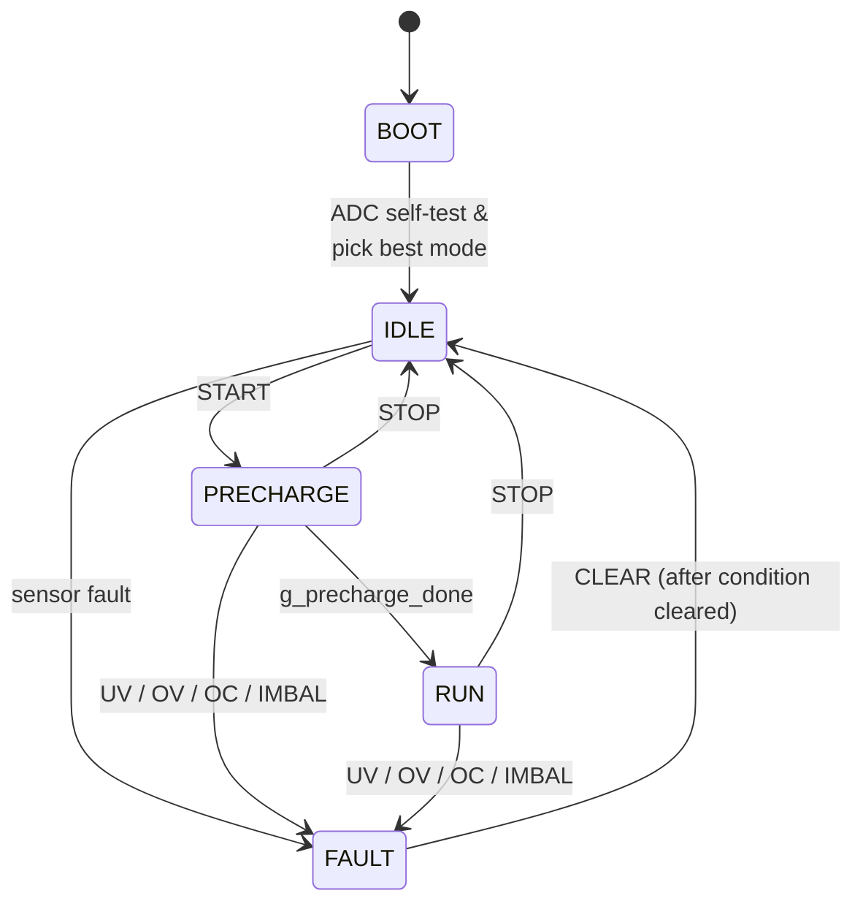

# State machine

The firmware is supervised by a 5-state FSM that owns the MOE-bit (PWM master output enable), sensor mode, and protection latch.

## Diagram

## What each state does

| State | MOE | Behavior |
|---|---|---|
| **BOOT** | 0 | Hardware init, ADC self-test, sensing-mode auto-selection. Drops to IDLE. |
| **IDLE** | 0 | Both advanced-timer MOE bits low. Accepts all commands. |
| **PRECHARGE** | 1 | MOE on; PWM ISR forces low-sides ON for 6 ms (3 PWM periods at 500 Hz) to charge the bootstrap caps. |
| **RUN** | 1 | PWM enabled. Protection runs after every 1 kHz sensor scan. |
| **FAULT** | 0 | MOE forced off via `BDTR.MOE = 0`; fault bits latched; `FAULT_OUT` pin pulled LOW. Operator must send `CLEAR` *after* the underlying condition is gone. |

The auto-start path is layered onto this: if no UART byte is received within 3 s of `FSM_Init()`, the FSM issues its own `START` and emits `$A,AUTO_START`. Sending any UART byte during the window cancels auto-start permanently for that boot cycle.

## Sensing modes (per-mode protection)

| ID | Mode | Sensors used | Active protection |
|---:|---|---|---|
| 0 | `FULL`     | DC1, DC2, current  | UV, OV, OC, imbalance |
| 1 | `DC_ONLY`  | DC1, DC2           | UV, OV, imbalance |
| 2 | `CUR_ONLY` | Current            | OC |
| 3 | `OPEN`     | None               | **None** — emits a UART warning |
| 4 | `DC1`      | DC1 (+ current if available) | DC1 UV/OV + OC if current passed |
| 5 | `DC2`      | DC2 (+ current if available) | DC2 UV/OV + OC if current passed |

At boot, each ADC is read four times; sensors stuck at `0x000` or `0xFFF` are marked unavailable and the FSM auto-demotes to the most capable supported mode (and emits `$E,MODE_DEMOTED`).

## Protection latch and CLEAR

A fault must hold for `PROTECTION_TRIP_COUNT = 3` consecutive 1 kHz sensor scans before it trips — 3 ms total. Any clean read resets the counter. Once latched, the FSM:

1. Forces `BDTR.MOE = 0` (PWM outputs go to their inactive level via `OSSI=1`).
2. Latches the offending fault bit(s) in `g_protection_latched`.
3. Pulls `FAULT_OUT` LOW.
4. Emits `$F,...` over UART.

`CLEAR` succeeds only when the underlying condition is gone. If the operator clears while UV is still active, the FSM stays in FAULT and re-emits `$F`.

## Forced fault (`TRIP`)

Operator-issued `TRIP` latches `FAULT_MANUAL (0x20)` and runs the full fault path — useful for demonstrating the protection chain when sensors aren't readable.

## See also

- Per-command behavior: [UART protocol](uart-protocol.md).
- Threshold defaults and the `VNOM` scaling: [Protection](protection.md).
- The raw source: [`Core/Src/fsm.c`](https://github.com/feaksel/chb-inverter/blob/main/firmware/stm32-f303re/Core/Src/fsm.c) and [`Core/Src/protection.c`](https://github.com/feaksel/chb-inverter/blob/main/firmware/stm32-f303re/Core/Src/protection.c).
