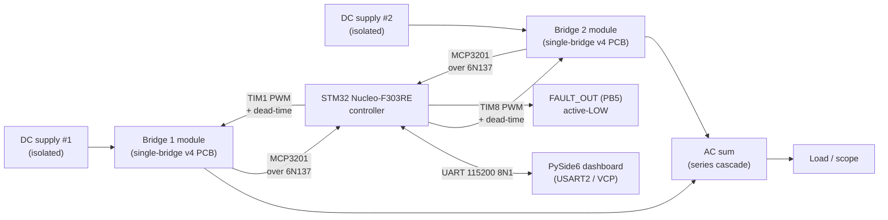

# Hardware architecture

The system is a single-phase **5-level Cascaded H-Bridge (CHB) multilevel inverter** built around **two identical single-bridge PCB modules** cascaded externally. Each module is one full H-bridge (four MOSFETs) with its own isolated DC supply, gate drive, and per-bridge sensing. The two modules' AC outputs are connected in series, summing to **five distinct cascade levels** at the inverter terminals.

## Block diagram

## What was actually delivered (as built)

| | Configuration |
|---|---|
| Cascade levels | 5 distinct, confirmed on scope |
| PCB modules | 2× single-bridge v4 (identical, 4-layer JLCPCB) |
| Power MOSFETs | IRFB4110 (100 V, 180 A, 4.5 mΩ) ×4 per module |
| Gate driver | TLP250 optically isolated (2.5 kV galvanic), one per leg |
| Gate supply | Isolated 5 V → 15 V DC-DC per module |
| DC sensing | MCP3201 12-bit ADC, isolated via 6N137 |
| Current sensing | ACS712 → MCP3201 (one per bridge return) |
| Controller | STM32 Nucleo-F303RE, Cortex-M4 at 64 MHz (HSI/2 × PLL) |
| Switching frequency | 5 kHz (PSC default), runtime-configurable 100 Hz – 20 kHz |
| Modulation | Phase-shifted carrier PWM (PSC) — the as-built default. Bridges thermally balanced. |
| Operator interface | PySide6 desktop dashboard (UART 115200 8N1) |

## Why these choices

### CHB topology

Modular structure, scalable, no clamping diodes, suitable for renewable-energy integration. The "isolated DC source per module" requirement — usually called out as a constraint — is actually an advantage here: it matches the way independent PV strings or battery packs naturally appear in a real installation.

The team evaluated NPC (clamping-diode complexity, unequal loss distribution) and Flying Capacitor (large pre-charged capacitors, complex bring-up) before settling on CHB. See the [ELE 401 interim report §6.1](https://github.com/feaksel/chb-inverter/blob/main/docs/final-report/index.md) for the full topology-selection narrative.

### MOSFET over IGBT — IRFB4110 specifically

At 50 V per module and 5 kHz switching, every loss term favours MOSFETs:

| | MOSFET (IRFB4110) | IGBT (typical) |
|---|---|---|
| On-state | Resistive (4.5 mΩ) | VCE(sat) ≈ 1.4 V |
| Conduction loss at 5 A | ≈ 0.11 W | ≈ 7 W |
| Switching loss at 5 kHz | ≈ 0.6 W (no tail current) | ≈ 5.5 W (tail current) |
| Body diode | Yes (free-wheeling) | External required |
| Cost (this rating) | Lower | Higher |

The IRFB4110 replaces the IRFZ44N called out in Build Guide v3.1's BOM. The IRFZ44N (55 V, 49 A, 17.5 mΩ) was found in bring-up to have insufficient thermal margin and a latent BOM hazard with the project's TVS choice — see the firmware CHANGELOG entry for **dead-time raised to 3 µs for the IRFB4110 power stage** and [Build Guide v4.0 — §4 Power stage](build-guide-v4.md) for the full reasoning.

### TLP250 optically isolated gate driver — not IR2110

The CHB cascaded structure imposes an **absolute requirement** for true galvanic isolation in the gate driver of any non-ground-referenced bridge. Bootstrap-based drivers like the IR2110 reference the high-side source terminal — which in a cascaded topology floats at the cascade's per-stage voltage. Simulink validation against an IR2110 model confirmed inadequate gate drive for the upper bridge.

The TLP250 has 2.5 kV galvanic isolation via LED + photodetector coupling, an independent isolated 15 V supply per driver, and works identically regardless of the bridge's floating potential. The 0.5 µs propagation delay (vs. the IR2110's 120 ns) is negligible against a 200 µs PWM period.

This is a **fundamental topology requirement**, not a preference. The firmware CHANGELOG documents the same constraint from the controller side.

### PSC over IPD LS-PWM

The team simulated and partially implemented IPD level-shifted PWM (LS-PWM) and switched to phase-shifted carrier (PSC) modulation in the final firmware. The deciding factor: IPD has an inherent bridge-loss asymmetry that requires an additional bridge-swap each fundamental cycle to even out. PSC is naturally bridge-balanced.

The bench validation confirmed:
- Five distinct cascade output levels visible on scope at 5 kHz PSC.
- Both bridges thermally matched under sustained load.

See [PSC vs. LSPWM](../design-notes/psc-vs-lspwm.md) and the firmware [modulators reference](../firmware/modulators.md).

### Sensing — MCP3201 over 6N137

DC bus and current are read by **MCP3201 12-bit SPI ADCs** on the floating bridge ground, with the SPI signals crossed back to the controller through **6N137 optocouplers** (independent per line). The firmware bit-bangs the SPI at ~140 kHz — well under the MCP3201's 1.6 MHz max — to keep the controller in firm control of edge ordering.

The 6N137 **inverts** (LED ON → output LOW). The firmware's [`SPIINV`](../firmware/uart-protocol.md) runtime command sets a per-line inversion mask so the polarity can be characterized at bring-up without reflashing.

## Per-module subschematic breakdown

The KiCad project for the single-bridge v4 module decomposes into seven sheets:

| Sheet | What it covers |
|---|---|
| `TOPDESIGN.kicad_sch` | Top-level: bridge composition + interfaces. |
| `Highside_cell.kicad_sch` | High-side MOSFET pair + their TLP250 drivers. |
| `Lowside_cell.kicad_sch` | Low-side MOSFET pair + their TLP250 drivers. |
| `driver_cell.kicad_sch` | Gate-drive details (TLP250 wiring, gate resistor, dead-time blocker). |
| `5v-15v_sch.kicad_sch` | Isolated 5 V → 15 V DC-DC for the gate-drive rail. |
| `Voltage_sensing_sch.kicad_sch` | DC bus voltage divider → MCP3201. |
| `current_sensing_sch.kicad_sch` | ACS712 current sensor → MCP3201. |

## Build-guide cross-reference

[Build Guide v4.0](build-guide-v4.md) is the canonical reference and supersedes Build Guide v3.1 (February 2026) in full. Where v3.1 disagrees with the as-built hardware (notably on the IRFZ44N MOSFETs and the PWM_1L pin assignment), **v3.1 is wrong** — see the build guide §13 errata and the firmware [pin map](../firmware/pin-map.md).
