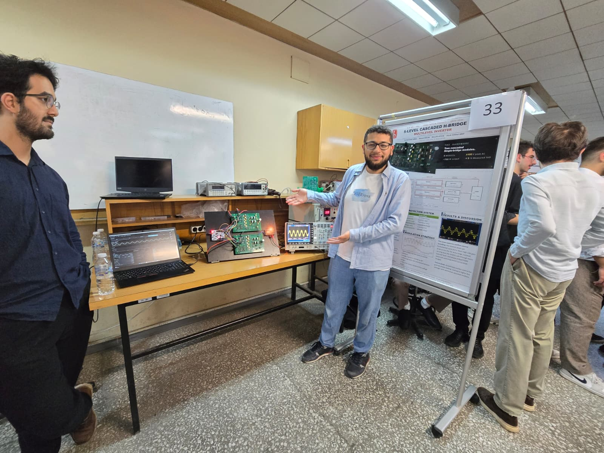
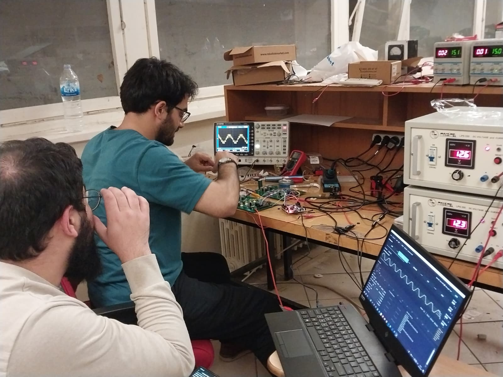
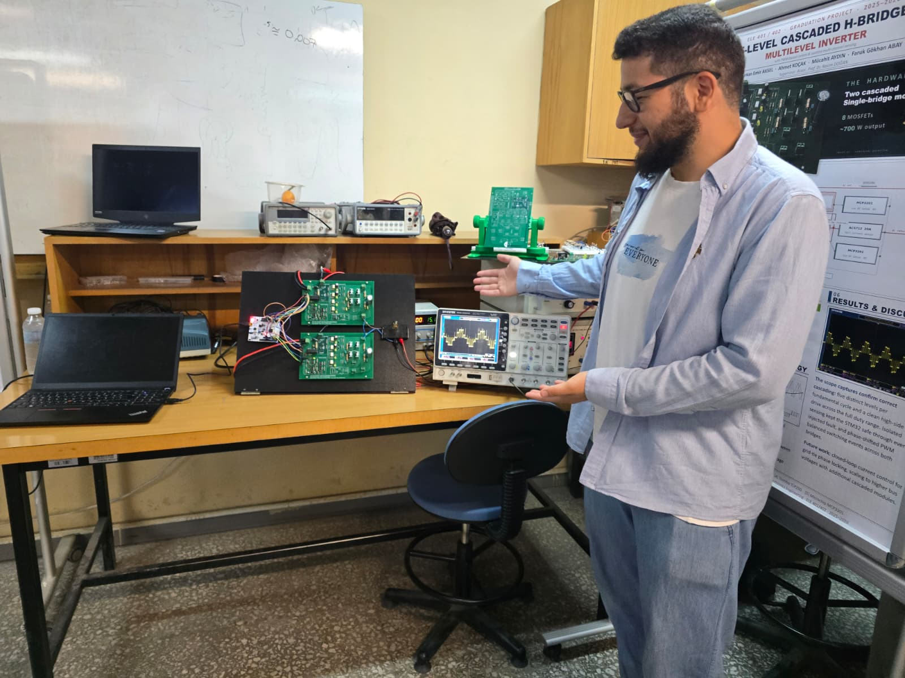
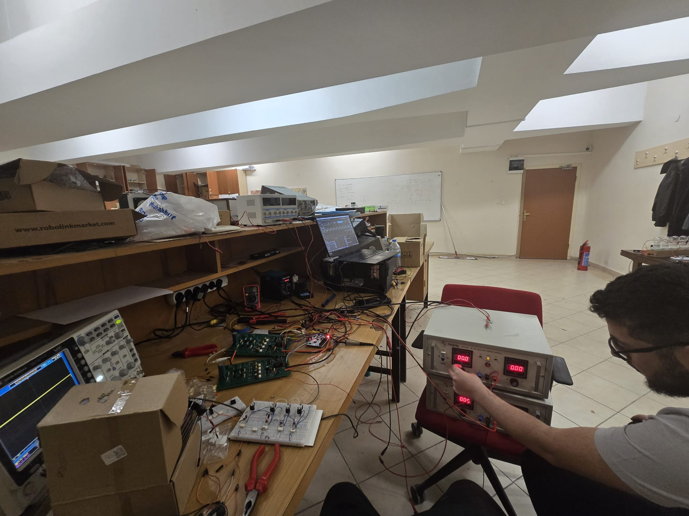
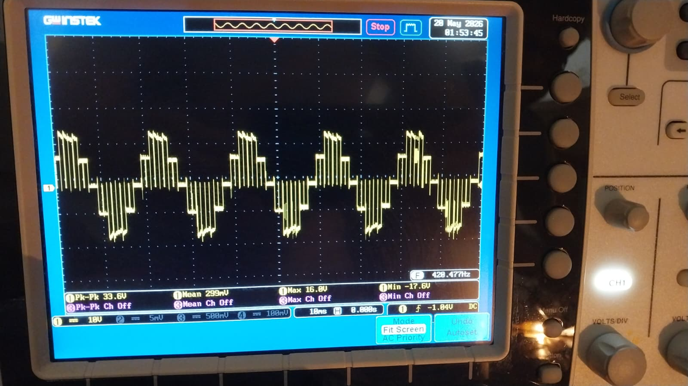

# Populated photos

Photos from the **bench bring-up** and **graduation demo day** for the as-built single-bridge v4 modules.

## Demo day — the hero shots

The team's demo of the running 5-level cascaded inverter.

{ loading=lazy }

{ loading=lazy }

{ loading=lazy }

{ loading=lazy }

{ loading=lazy }

{ loading=lazy }

{ loading=lazy }

## Oscilloscope captures

Scope traces from the PSC bench run. The cascade-output capture confirms five distinct levels — the project deliverable.

{ loading=lazy }

{ loading=lazy }

{ loading=lazy }

{ loading=lazy }

{ loading=lazy }

## Earlier bench session (2026-03-05)

Photos from a mid-development bench day, before the final cleanup. Useful for context — they show the boards in their bring-up configuration.

{ loading=lazy }

{ loading=lazy }

{ loading=lazy }

{ loading=lazy }

{ loading=lazy }

{ loading=lazy }

## Earlier breadboard prototype

For continuity, the earlier breadboard half-bridge with the gate-drive LED visibly switching during bring-up of the gate drive itself:

{ loading=lazy }

This is **not** the as-built PCB — it is the team's debug rig used while characterizing the gate drive before committing to the PCB layout.

## What's still pending

- More dead-time scope captures (rising / falling edge zoom).
- Thermal scan of the bridges under sustained PSC load.
- Individual close-up shots of each populated PCB module (top + bottom).

(Tracked at [`_AGENT_TRACKER.md`](https://github.com/feaksel/chb-inverter/blob/main/_AGENT_TRACKER.md) — artifact #8.)
