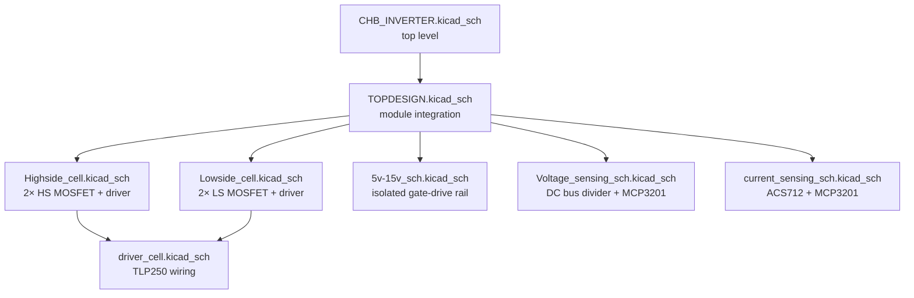
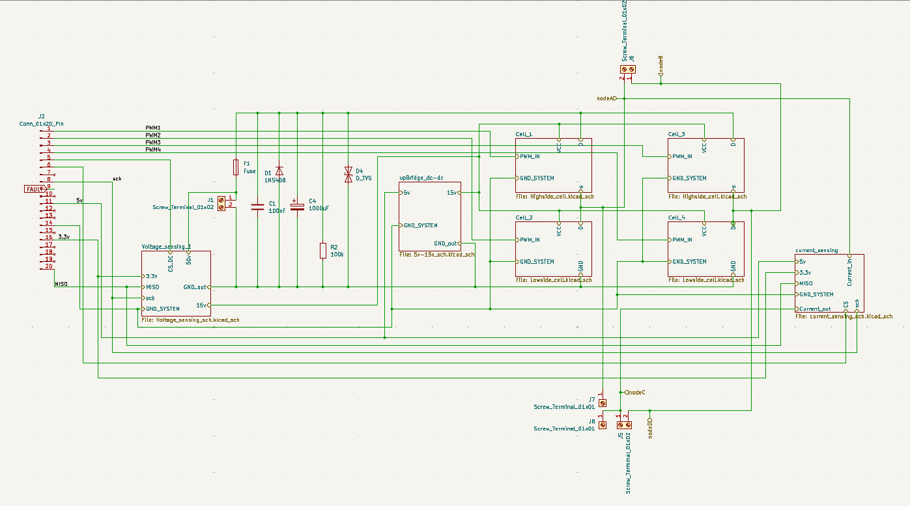
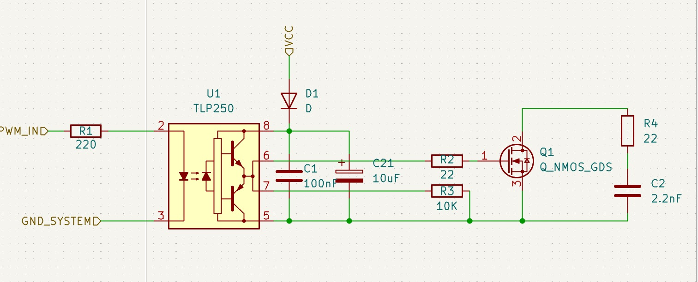
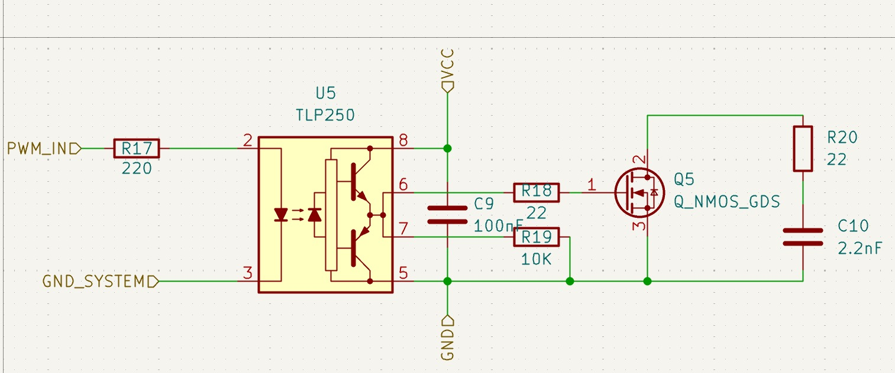
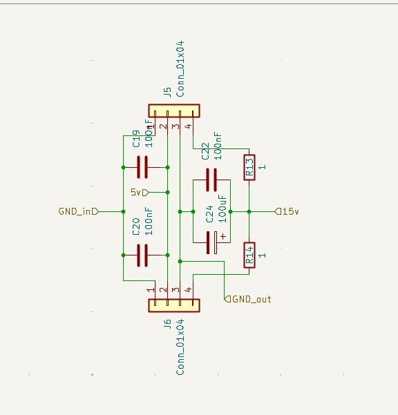
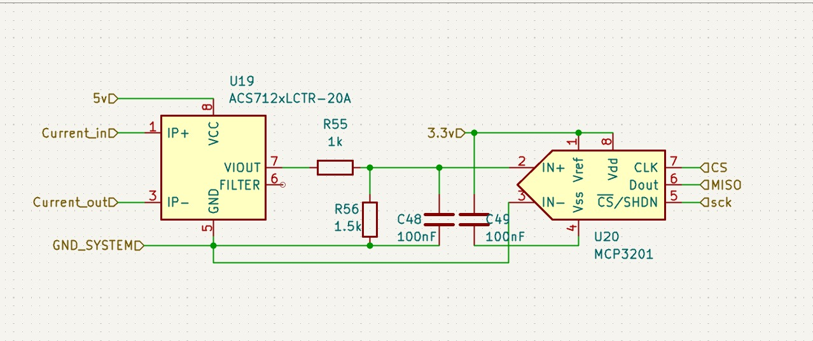
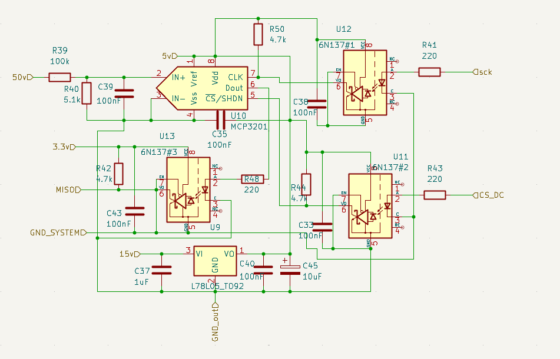

# Schematic

The schematic source is a hierarchical KiCad project rooted at [`CHB_INVERTER.kicad_sch`](https://github.com/feaksel/chb-inverter/blob/main/hardware/single-bridge-v4/kicad/CHB_INVERTER.kicad_sch). It decomposes into seven sheets — each captures one logical block of the single-bridge module.

## Hierarchical decomposition



## Block-level summaries

These small block diagrams were authored by the team during the schematic design phase and are kept as design-intent references.

<div class="grid cards" markdown>

-   :material-power-plug:{ .lg .middle } &nbsp;**Full-design overview**

    ---

    

-   :material-router-network:{ .lg .middle } &nbsp;**Modular cascade**

    ---

    

-   :material-flash:{ .lg .middle } &nbsp;**High-side cell**

    ---

    

-   :material-flash-outline:{ .lg .middle } &nbsp;**Low-side cell**

    ---

    

-   :material-battery-charging:{ .lg .middle } &nbsp;**Isolated 5 V → 15 V driver supply**

    ---

    

-   :material-current-dc:{ .lg .middle } &nbsp;**Current sensor (ACS712 → MCP3201)**

    ---

    

-   :material-resistor-nodes:{ .lg .middle } &nbsp;**Voltage divider + MCP3201**

    ---

    

</div>

## How to open the schematic

```powershell
# From the repo root in PowerShell:
& "C:\Program Files\KiCad\9.0\bin\kicad.exe" hardware/single-bridge-v4/kicad/CHB_INVERTER.kicad_pro
```

The project was authored in **KiCad 9** (April 2026). Older versions may produce schema-version warnings on open — usually harmless, but the project was last saved with v9 nightly features (`generator_version 9`).

## Export to PDF

The PDF schematic export is regenerable from the KiCad CLI:

```powershell
kicad-cli sch export pdf `
    --output docs/assets/pdfs/CHB_INVERTER_schematic.pdf `
    hardware/single-bridge-v4/kicad/CHB_INVERTER.kicad_sch
```

(Once generated, this PDF can be linked from this page for offline review. The team has not yet exported a final PDF; the editable schematic remains canonical.)

## Source files

| File | Bytes | Role |
|---|---:|---|
| [`CHB_INVERTER.kicad_pro`](https://github.com/feaksel/chb-inverter/blob/main/hardware/single-bridge-v4/kicad/CHB_INVERTER.kicad_pro) | 16 K | Project metadata + library settings |
| [`CHB_INVERTER.kicad_sch`](https://github.com/feaksel/chb-inverter/blob/main/hardware/single-bridge-v4/kicad/CHB_INVERTER.kicad_sch) | 100 K | Top-level schematic |
| [`TOPDESIGN.kicad_sch`](https://github.com/feaksel/chb-inverter/blob/main/hardware/single-bridge-v4/kicad/TOPDESIGN.kicad_sch) | 86 K | Module integration sheet |
| [`Highside_cell.kicad_sch`](https://github.com/feaksel/chb-inverter/blob/main/hardware/single-bridge-v4/kicad/Highside_cell.kicad_sch) | 52 K | High-side MOSFET pair + drivers |
| [`Lowside_cell.kicad_sch`](https://github.com/feaksel/chb-inverter/blob/main/hardware/single-bridge-v4/kicad/Lowside_cell.kicad_sch) | 43 K | Low-side MOSFET pair + drivers |
| [`driver_cell.kicad_sch`](https://github.com/feaksel/chb-inverter/blob/main/hardware/single-bridge-v4/kicad/driver_cell.kicad_sch) | 34 K | TLP250 wiring, gate resistor, GS pull-down |
| [`5v-15v_sch.kicad_sch`](https://github.com/feaksel/chb-inverter/blob/main/hardware/single-bridge-v4/kicad/5v-15v_sch.kicad_sch) | 28 K | B0515S isolated 5 V → 15 V DC-DC + filter |
| [`Voltage_sensing_sch.kicad_sch`](https://github.com/feaksel/chb-inverter/blob/main/hardware/single-bridge-v4/kicad/Voltage_sensing_sch.kicad_sch) | 79 K | DC bus divider → MCP3201 → 6N137 isolation |
| [`current_sensing_sch.kicad_sch`](https://github.com/feaksel/chb-inverter/blob/main/hardware/single-bridge-v4/kicad/current_sensing_sch.kicad_sch) | 27 K | ACS712 → MCP3201 → 6N137 isolation |
