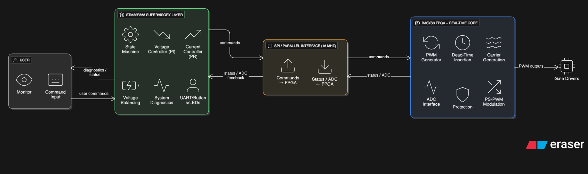

# Roadmap

<figure markdown="span">
  { loading=lazy width=75% }
  <figcaption>An earlier exploration of a productionized topology including LC filtering and closed-loop control. The roadmap items below describe what would actually be needed to get there from the as-built single-phase open-loop bench prototype.</figcaption>
</figure>

Future work — what we'd pick up after the graduation deliverable, in roughly the order we'd recommend tackling it. Drawn from [Build Guide v4.0 §15](../hardware/build-guide-v4.md).

## Tracks

| Track | One-liner |
|---|---|
| [PSC tuning](ps-pwm-tuning.md) | Already implemented — this page covers further tuning beyond what was demonstrated. |
| [LC filter](lc-filter.md) | A staged LC filter on the inverter output to drop THD further before any load. |
| [Closed-loop control](closed-loop-control.md) | Output-voltage feedback into the modulator — currently open-loop. |
| [Grid tie](grid-tie.md) | Synchronization, anti-islanding, and the safety implications of grid coupling. |
| [Thermal enclosure](thermal-enclosure.md) | The boards are bench-thermally-balanced; an enclosed deployment needs forced air or a heatsink redesign. |
| [Product path](product-path.md) | What turning the project from a graduation deliverable into a product would actually take. |

The [experimental tracks](https://github.com/feaksel/chb-inverter/tree/main/experimental) (RISC-V SoC, FPGA controller) are deliberately not in this list — they have no validated path to the as-built hardware.
