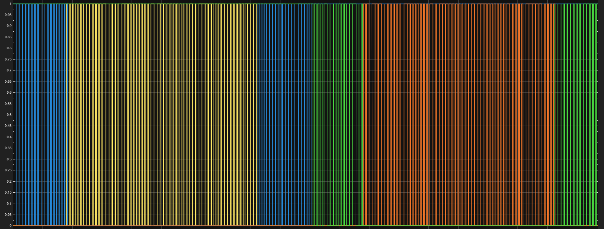

# Simulation

<figure markdown="span">
  { loading=lazy width=75% }
  <figcaption>Early Simulink trace of the per-bridge PWM output and the cascade sum. The model produced the headline <b>THD = 4.9 %</b> prediction that justified the topology and modulation choices.</figcaption>
</figure>

Pre-hardware Simulink work that informed the topology, modulation, and dead-time choices.

## Pages in this section

| Page | Purpose |
|---|---|
| [Overview](overview.md) | What was simulated, what the headline numbers were, what the model didn't capture. |
| [THD analysis](thd-analysis.md) | The FFT results from the model output (predicted ~4.9 % pre-filter), side-by-side with bench measurements. |
| [Models](models.md) | The Simulink model architecture — block-by-block — and how to rerun it. |

The Simulink work was a **design-time aid**, not a live model. The bench-validated numbers are what go into the [final report](../final-report/index.md); the simulation explains the *why* of the topology choices.
