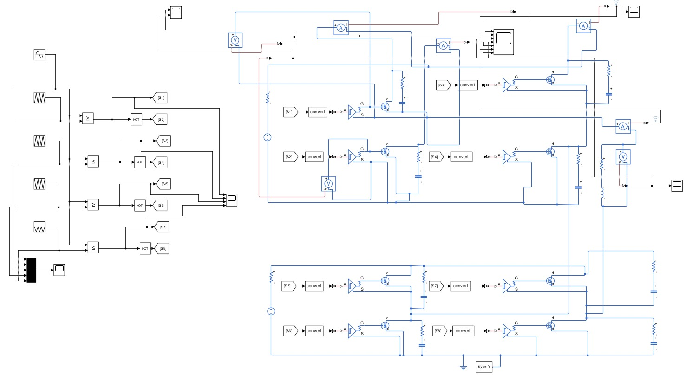
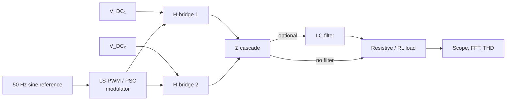
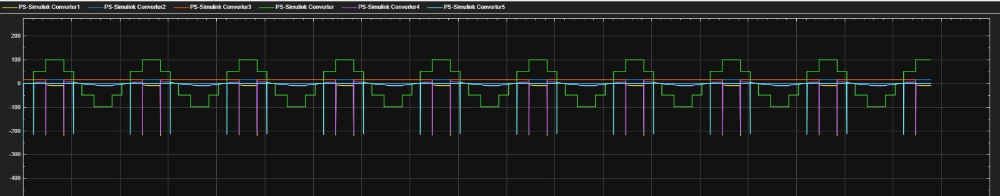

# Model architecture

<figure markdown="span">
  { loading=lazy width=85% }
  <figcaption>The final Simulink circuit — two cascaded H-bridges with the TLP250-isolated gate drive (per <a href="../../design-notes/chb-isolation/">chb-isolation</a>), the LS-PWM/PSC modulator, and the LC filter + load stage. This is the v3 model (<code>chb-5level-rl-nospike.slx</code>) after the snubber-tuning pass that removed VDS ringing.</figcaption>
</figure>

Three Simulink models live in [`simulation/simulink/`](https://github.com/feaksel/chb-inverter/tree/main/simulation/simulink). They share a common block structure; the differences are in the gate-driver model, the modulator, and the load.

## Common structure

## Per-model details

### `chb-5level-v1.slx` — IPD LS-PWM baseline

The first-pass model. Ideal complementary switches, no parasitics, no dead time. Used to:

- Confirm the 5-level cascade arithmetic (output level ∈ {−2, −1, 0, +1, +2}·VDC).
- Produce the **headline THD = 4.9 %** figure with IPD level-shifted PWM at 5 kHz.
- Validate the IEEE 519-2022 voltage-distortion compliance argument.

**Inputs:** two independent 50 V DC sources, 50 Hz reference, MI = 0.95.
**Output measurement:** the cascade output is scoped + FFT'd to extract THD.

### `chb-5level-v2.slx` — gate-driver sweep

Adds gate-driver behavioural models:

- **IR2110 (bootstrap)**: the bootstrap capacitor follows VS of the high-side MOSFET. Because the upper bridge's VS floats at the cascade voltage, the bootstrap path never returns to true ground, and the simulated gate drive collapses to < 5 V on the upper bridge — MOSFETs fail to turn on. Output waveform: severely distorted, irrecoverable.
- **TLP250 (optical)**: independent isolated 15 V supply per driver. All eight gates see 15 V regardless of floating potential. Output waveform: matches the ideal 5-level cascade.

This model is **the evidence that killed the IR2110 path** before any silicon was committed. The TLP250 → 6N137 → MCP3201 sensing chain on the actual hardware traces directly to this simulation.

### `chb-5level-rl-nospike.slx` — RL load + LC filter sweep

Adds:

- **LC output filter** (parametrised — see the [THD analysis](thd-analysis.md) for the values tried).
- **RL load** (10 Ω + 5 mH) to surface the wavy-current artefact under inductive load.
- **No spike** in the title refers to the snubber-tuning pass that removed the VDS ringing the earlier model showed.

Used to size the bench LC filter (planned roadmap item; not built).

<figure markdown="span">
  { loading=lazy width=80% }
  <figcaption>The "before" view — Simulink output when the snubber network is removed. The VDS ringing visible here is exactly what the 22 Ω 2 W + 2.2 nF / 630 V snubber on every MOSFET damps in the as-built hardware.</figcaption>
</figure>

## How to run

1. Install MATLAB R2023b or later with Simscape Electrical.
2. Open the `.slx` file.
3. Press **Run**. Default simulation time is 100 ms (≈ 5 fundamental periods).
4. The output scopes show: cascade voltage, per-bridge contributions, load current.
5. To extract THD, run `thd(simout.OutputVoltage.Data, simout.OutputVoltage.Time(2) - simout.OutputVoltage.Time(1), 50)`.

A reusable `thd-analysis.m` helper is **not yet committed** — the team ran analysis directly in the MATLAB console. Adding the helper to `simulation/matlab/` is tracked as a polish item.
