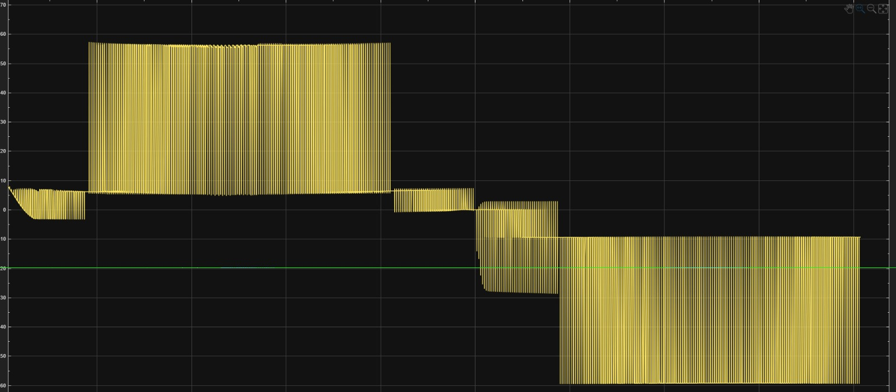

# Simulation overview

The Simulink work was a **design-time aid** — it informed the topology, modulation, and gate-drive choices before any silicon was committed. It was not a live model and is not part of the runtime control loop.

## Headline results

| Metric | Value | Source |
|---|---|---|
| Predicted THD (pre-filter, LS-PWM) | **4.9 %** | LS-PWM model output, validated against the IEEE 519-2022 < 8 % limit |
| Predicted efficiency | > 95 % | Pre-filter, ideal switches, design-target load (≈ 400 W) |
| Predicted gate-drive failure mode | IR2110 floating reference | The simulation that killed the IR2110 path and forced the TLP250 choice |

## What was simulated

Three Simulink models are kept in `simulation/simulink/`:

| Model | What it covers |
|---|---|
| [`chb-5level-v1.slx`](https://github.com/feaksel/chb-inverter/blob/main/simulation/simulink/chb-5level-v1.slx) | First-pass 5-level CHB with IPD LS-PWM, ideal switches, resistive load. The model that produced the 4.9 % THD figure. |
| [`chb-5level-v2.slx`](https://github.com/feaksel/chb-inverter/blob/main/simulation/simulink/chb-5level-v2.slx) | Revised topology with the gate-drive sweep (IR2110 vs. TLP250) added. The IR2110 path is where the floating-reference failure showed up. |
| [`chb-5level-rl-nospike.slx`](https://github.com/feaksel/chb-inverter/blob/main/simulation/simulink/chb-5level-rl-nospike.slx) | LC-filtered variant with an RL load — used to characterize the wavy-current artefact and tune the snubber. |

<figure markdown="span">
  { loading=lazy width=80% }
  <figcaption>Simulink output at an elevated switching frequency — used during the parameter sweeps that informed the final 5 kHz choice. Higher fsw sharpens the output and pushes the ripple energy up where a smaller LC filter can attenuate it, at the cost of switching loss.</figcaption>
</figure>

## What the model does *not* capture

- **Parasitic inductance.** Gate-loop and DC-bus parasitics that cause real-world voltage spikes are not in the ideal-switch model. The snubber design (22 Ω 2 W + 2.2 nF / 630 V) was specified to bound these on the bench, not in simulation.
- **Dead time.** Simulink uses ideal complementary switches; the firmware enforces 3 µs dead time on the IRFB4110. Shoot-through margin is verified on the scope, not in the model.
- **Sensor noise + isolation.** The MCP3201 + 6N137 chain has SPI line inversion and rail-stuck detection in the firmware; none of that is reflected in the simulation's idealized sensor model.
- **Thermal coupling.** The model assumes both bridges at room temperature; the bench validation actually measured per-bridge MOSFET case temperatures.

The bench-validated numbers are what go into the [final report](../final-report/index.md). The simulation explains the *why* of the topology and gate-drive choices.

## See also

- [THD analysis](thd-analysis.md) — the FFT side-by-side and the per-harmonic content.
- [Model architecture](models.md) — block-by-block walk-through.
- [PSC vs. LSPWM design note](../design-notes/psc-vs-lspwm.md) — the cascade-balance argument that drove the switch from IPD to PSC after the simulation was complete.
