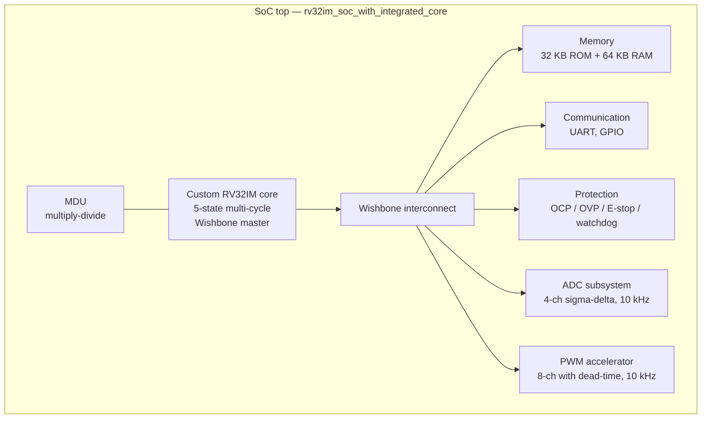

# RISC-V SoC for the 5-Level Inverter (experimental)

> ⚠️ **Not validated in silicon and not in the bring-up path of the inverter.**
> This directory holds a complete RISC-V SoC project — RTL through GDSII — that was developed in parallel with the inverter as an exploratory track. **The graduation deliverable uses the STM32 path.** Nothing in this folder is wired to the as-built hardware.

## What's here

A custom **RV32IM** RISC-V SoC (32-bit integer + multiply-divide), hand-written in Verilog, integrated with the seven peripherals an inverter controller would need (PWM, ADC, protection, timer, GPIO, UART, memory). Taken through a full **Cadence Genus → Innovus → GDSII** flow against the **SkyWater 130 nm** PDK.



The integrated SoC GDSII is at [`macros/soc_integrated/rv32im_soc_with_integrated_core.gds`](macros/soc_integrated/rv32im_soc_with_integrated_core.gds) (≈ 49 MB, LFS-tracked). Per-block GDSII for each subsystem is in the matching `macros/<block>/` subfolder.

## Per-block tape-out summary

| Block | Role | GDSII |
|---|---|---|
| `core_macro` | The RV32IM CPU itself — 5-state multi-cycle pipeline, 32 GP registers, native Wishbone interface | [`macros/core_macro/core_macro.gds`](macros/core_macro/core_macro.gds) |
| `mdu_macro` | Multiply-divide unit — implements M-extension | [`macros/mdu_macro/mdu_macro.gds`](macros/mdu_macro/mdu_macro.gds) |
| `memory_macro` | ROM (32 KB instructions) + RAM (64 KB data); v2 includes the SkyWater SRAM | [`macros/memory_macro/memory_macro.gds`](macros/memory_macro/memory_macro.gds), [`...memory_macro2.gds`](macros/memory_macro/memory_macro2.gds) |
| `protection_macro` | Overcurrent / overvoltage / E-stop / watchdog logic | [`macros/protection_macro/protection_macro.gds`](macros/protection_macro/protection_macro.gds) |
| `adc_subsystem_macro` | 4-channel sigma-delta ADC subsystem at 10 kHz | [`macros/adc_subsystem_macro/adc_subsystem_macro.gds`](macros/adc_subsystem_macro/adc_subsystem_macro.gds) |
| `pwm_accelerator_macro` | 8-channel PWM generator with hardware dead-time insertion | [`macros/pwm_accelerator_macro/pwm_accelerator_macro.gds`](macros/pwm_accelerator_macro/pwm_accelerator_macro.gds) |
| `communication_macro` | UART (115200 baud, 8N1) + 32-pin GPIO | [`macros/communication_macro/communication_macro.gds`](macros/communication_macro/communication_macro.gds) |
| `rv32im_integrated` | Core + MDU + register file integrated (no peripherals) | [`macros/rv32im_integrated/rv32im_integrated_macro.gds`](macros/rv32im_integrated/rv32im_integrated_macro.gds) |
| `soc_integrated` | **Full SoC** — RV32IM + all peripherals + memory | [`macros/soc_integrated/rv32im_soc_with_integrated_core.gds`](macros/soc_integrated/rv32im_soc_with_integrated_core.gds) |

Each macro also ships a `.lef` (cell placement), `.sdc` (timing constraints), `*_netlist.v` (post-PnR netlist), and `*_stub.v` (interface stub for higher-level synthesis).

## Layout renders

The [`renders/`](renders/) directory holds PNG layouts for every block in two variants:

| Variant | Purpose | Files |
|---|---|---|
| [`renders/blueprint/`](renders/blueprint/) | Bluish PCB-blueprint style — good for posters and presentation | 11 files |
| [`renders/clean/`](renders/clean/) | High-contrast clean render — good for embedding in documentation | 11 files |

Headline: the full-SoC clean render is at [`renders/clean/rv32im_integrated_macro.png`](renders/clean/rv32im_integrated_macro.png).

## What's *not* here

This experimental track is intentionally **not** wired into the inverter's bring-up:

- No silicon tape-out. The GDSII files exist; no foundry submission was made.
- No FPGA equivalence check. The RTL could be ported to a Zynq / Cyclone for in-system validation; that work isn't done.
- No level-shifter board to interface the SoC's PWM outputs to the existing TLP250 + 6N137 isolation chain.
- No JTAG debug interface in the current design.

If someone picks this up, [`docs/IMPLEMENTATION_ROADMAP.md`](docs/IMPLEMENTATION_ROADMAP.md) and [`docs/HANDMADE_README.md`](docs/HANDMADE_README.md) (the project's own README, preserved verbatim from the source tree) are the starting points.

## Directory layout

```
experimental/risc-v-soc/
├── README.md                 # This file
├── rtl/                      # Verilog source — core, peripherals, memory, bus, soc
├── firmware/                 # Embedded C drivers + example programs
├── sim/                      # Verilog testbenches + open-source simulation harness
├── synthesis/                # Synthesis scripts (Cadence Genus + open-source Yosys)
├── programs/                 # Example RISC-V programs that run on the SoC
├── tools/                    # Build / lint helpers
├── constraints/              # FPGA constraint files (Basys3 example)
├── docs/                     # Architecture + implementation docs (12 files)
│   ├── CSR_*.md              # Control / status register architecture
│   ├── MDU_*.md              # Multiply-divide unit
│   ├── ZPEC_*.md             # Custom power-electronics extensions
│   ├── IMPLEMENTATION_ROADMAP.md
│   └── HANDMADE_README.md    # Original project README
├── macros/                   # Per-block tape-out artifacts (GDS / LEF / SDC / netlist)
│   ├── adc_subsystem_macro/
│   ├── communication_macro/
│   ├── core_macro/
│   ├── mdu_macro/
│   ├── memory_macro/
│   ├── protection_macro/
│   ├── pwm_accelerator_macro/
│   ├── rv32im_integrated/
│   └── soc_integrated/       # The full SoC
└── renders/
    ├── blueprint/            # Poster-style layouts (11 PNGs)
    └── clean/                # Documentation-style layouts (11 PNGs)
```

## How to open the GDSII

The GDSII files are LFS-tracked. After cloning the repo, you'll need Git LFS installed and the files pulled:

```powershell
git lfs install
git lfs pull
```

Then open in any GDSII viewer — **KLayout** is the standard free choice. The full SoC layout:

```powershell
klayout experimental/risc-v-soc/macros/soc_integrated/rv32im_soc_with_integrated_core.gds
```

## License + PDK notes

The RTL is licensed under Apache-2.0 along with the rest of this repository. The GDSII files were produced against the [SkyWater 130 nm PDK](https://github.com/google/skywater-pdk), which has its own open-source license (Apache-2.0). No part of the SkyWater PDK is included in this repository — only the project's own GDSII output, which references PDK cells by name.

## Why this is documented but not linked from the main report

Per the project's editorial decision: the graduation deliverable is the **STM32-based 5-level inverter**. The RISC-V SoC is preserved for continuity (someone may pick it up; the work is real and substantial) but is intentionally outside the main report's scope. The main repo [`README.md`](../../README.md) and this folder are the only places the experimental track is linked from.

If you're reading this looking to extend the inverter project: start at [`../../README.md`](../../README.md) and look at the [Future / Experimental tracks](../README.md) section. The RISC-V silicon path is one possible future; an FPGA controller ([`../fpga-controller/`](../fpga-controller/)) is another.
